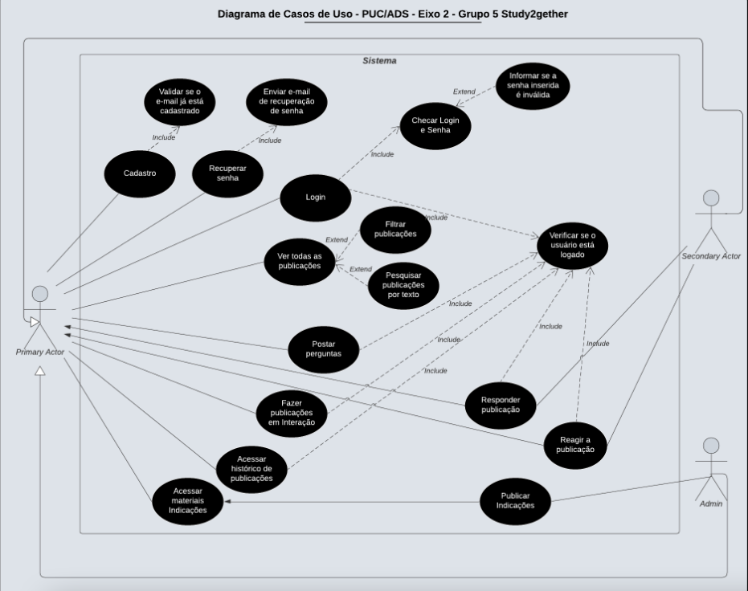

# Especificações do Projeto

Pré-requisitos: <a href="1-Documentação de Contexto.md"> Documentação de Contexto</a>

A abordagem do problema e seus objetivos foram extraídos de uma pesquisa realizada pelos alunos participantes do grupo. Nessa pesquisa foram entrevistados outros alunos do curso de Análise e Desenvolvimento de Sistemas por serem os pretensos usuários da aplicação. Os dados obtidos são apresentados a seguir como personas e histórias de usuários.

## Personas

As personas levantadas durante o processo de entendimento do problema são apresentadas a seguir:

1 - RINGUI FERDINANDO tem 27 anos, é mecânico e estudante prestes a se formar no ensino superior de TI. Seus Hobbies são: passar tempo com a família; programar; estudar e assistir animes.

Atualmente Ringui exerce a atividade de mecânico, porém percebeu que estava distante de sua família e perdendo muito do crescimento dos filhos trabalhando na oficina, portanto, com muito esforço, está em mudança de carreira para a área de TI. Agora completamente motivado a seguir nessa área, ele procura as melhores formas de estudar e se aprimorar para no futuro poder trabalhar de casa ao lado de sua família.

Suas frustrações são: a dificuldade de encontrar uma forma de tirar dúvidas enquanto estuda para a faculdade em horários noturnos e não saber onde procurar materiais mais específico para as suas dúvidas de cada eixo. 

Já sua motivação é o aprimoramento de seus estudos para se tornar destaque na área de TI quando se formar e concorrer a vagas no exterior. 

2 - ARTHUR SILVA tem 23 anos, é auxiliar de escritório e estudante de programação. Seus Hobbies são: programar, praticar atividades físicas, ficar com a família e ler bons livros.

Arthur é um jovem que mora com os pais, trabalha durante o dia como auxiliar de escritório e a noite faz um curso na modalidade EAD de desenvolvimento de software. Está em busca de uma boa oportunidade na área de TI para que possa ajudar sua família.

Sua frustação é a dificuldade em buscar conteúdos gratuitos relacionados às matérias de seu curso.

Já suas motivações são: fazer networking com outros estudantes de ADS e ter mais produtividade acadêmica.

3 - CLÁUDIA SANCHES tem 25 anos, é economista e estudante de Análise e Desenvolvimento de Sistemas na PUC Minas Virtual. Seus Hobbies são: ler, ouvir podcasts, praticar Inglês e sair com amigos.

Cláudia é solteira e trabalha como analista de investimentos em uma corretora paulista que tem escritório em Belo Horizonte. Por se interessar muito pela área de TI resolveu investir em uma nova formação, optando pelo curso de Análise e Desenvolvimento de Sistemas na PUC-Minas Virtual. Seu objetivo é se tornar uma Software Engineer e assim ter a liberdade de se candidatar a vagas no exterior.

Sua frustração é sentir-se um pouco só no curso a distância, tem baixíssima interação com colegas e professores. Sente falta das discussões em sala de aula, que para ela, agregam muito no desenvolvimento da classe.

Já suas motivações são: desenvolver-se profissionalmente e vê na sua formação em tecnologia uma forma de impulsionar uma nova carreira no exterior e quer também ampliar seus conhecimentos.

4 - ALPÍDIO ROMEO tem 26 anos, é programador Freelancer, estudante de Análise e Desenvolvimento de Sistemas. Seus Hobbies são: programar, jogar RPG de mesa e jogar League of Legends. 

Alpídio entrou no mundo da computação desde muito cedo, quando criança sempre sonhou em desenvolver um jogo do tipo RPG de mesa, em sua adolescência conseguiu criar o seu primeiro protótipo. Alpídio, de família simples, teve que procurar logo seu primeiro emprego para ajudar nas despesas de casa, e teve que abandonar o seu tão amado projeto e procurar por um emprego informal na área de desenvolvimento web. Com o passar dos anos, Alpídio adquiriu uma vasta experiência na área, mas nunca teve um emprego formal, tampouco tempo para voltar a desenvolver jogos.

Sua frustração está na dificuldade de encontrar uma forma de testar seus conhecimentos já adquiridos, e os em desenvolvimento no curso superior, e fortalecer a sua rede de contatos profissionais na área.

Já sua motivação está em obter o diploma de ensino superior para conseguir entrar no mercado formal de desenvolvimento de software, e poder aproveitar de todos os benefícios concedidos pela empresa à classe.

5 - JANSOM BERGSON tem 27 anos, é auxiliar administrativo na PUC Minas e estudante de ADS. Seus Hobbies são: games, treinar e assistir séries.

Jansom sempre gostou de jogos de RPG e Simulação e isso o aproximou da computação, a curiosidade fez descobrir algumas tecnologias, no entanto, acabou se distanciando desse universo. Então conheceu o curso de análise e desenvolvimento de sistemas, e desde então vem buscando se desenvolver nesta área.

Suas frustrações estão na dificuldade de tirar dúvidas com outros alunos, do meu eixo e/ou diferentes eixos, podendo aprender com experiência de outros alunos e contribuir com o aprendizado de outros alunos.

Já sua motivação está em buscar na graduação de Análise e Desenvolvimento de Sistemas o conhecimento necessário para mudar de carreira.

## Histórias de Usuários

A partir da compreensão do dia a dia das personas identificadas para o projeto, foram registradas as seguintes histórias de usuários:

|EU COMO... `PERSONA`| QUERO/PRECISO ... `FUNCIONALIDADE` |PARA ... `MOTIVO/VALOR`                 |
|--------------------|------------------------------------|----------------------------------------|
|Ringui Ferdinando   | um local onde eu possa estudar e tirar dúvidas independente do horário  | poder estudar em horários que não comprometam meu trabalho atual. |   
|Ringui Ferdinando   | uma plataforma organizada e dividida por cada eixo da faculdade de ADS | encontrar materiais específicos mais rapidamente e otimizar o pouco tempo que tenho para estudar. | 
|Arthur Silva        | um espaço onde eu possa fazer perguntas relacionadas às matérias e ao mundo da programação | esclarecer minhas dúvidas como iniciante na área.|
|Arthur Silva        | uma plataforma que permita conhecer novas pessoas aspirantes do setor de tecnologia | fortalecer minha networking e conseguir indicações em empresas de interesse.|
|Cláudia Sanches     | poder pesquisar informações sobre determinado assunto ou disciplina do curso | me auxiliar no esclarecimento de dúvidas específicas sobre o conteúdo das matérias.|
|Cláudia Sanches     | uma ferramenta que me permita  interagir com colegas | resgatar o senso de comunidade estudantil.|
|Alpídio Romeo       | um local onde eu possa estudar e responder as dúvidas de outros alunos | poder treinar meus conhecimentos adquiridos, aprimorar minha expertise em determinados tópicos e me sentir mais preparado para procurar por uma vaga de engenheiro de software.|
|Alpídio Romeo       | poder saber o feedback de minhas respostas e ser notificado quando respondido | conseguir estimar a didática e domínio no assunto, e saber se preciso revisar algum conceito.|
|Jansom Bergson      | poder ter acesso às minhas interações | relembrar e/ou responder as perguntas que eu fiz, ou respondi.|

## Requisitos e Restrições do Projeto

O escopo funcional do projeto é definido por meio dos requisitos funcionais que descrevem as possibilidades interação dos usuários, bem como os requisitos não funcionais que descrevem os aspectos que o sistema deverá apresentar de maneira geral. Estes requisitos são apresentados a seguir.

### Requisitos Funcionais

A tabela a seguir apresenta os requisitos do projeto, identificando a prioridade em que os mesmos devem ser entregues.

|ID      | Descrição do Requisito  | Prioridade |
|--------|-----------------------------------------|----|
|RF-01   | A aplicação deve permitir ao usuário a fazer publicações. | ALTA | 
|RF-02   | A aplicação deve apresentar um filtro por eixos ou por microfundamentos.   | ALTA |
|RF-03   | A aplicação deve permitir ao usuário postar perguntas. | ALTA | 
|RF-04   | A aplicação deve permitir ao usuário responder as perguntas e publicações.   | ALTA |
|RF-05   | A aplicação deve oferecer uma funcionalidade de pesquisa com campo de texto. | ALTA | 
|RF-06   | A aplicação deve permitir ao usuário se cadastrar e realizar o login.   | ALTA |
|RF-07   | A aplicação deve permitir ao usuário ter acesso a um feed com seu histórico de ações. | ALTA | 
|RF-08   | A aplicação deve permitir visualizar todas as publicações.   | MÉDIA |
|RF-09   | A aplicação deve permitir ao usuário reagir com reações de emojis. | BAIXA | 
|RF-10   | A aplicação deve permitir ao usuário recuperar sua senha.   | BAIXA |
|RF-11   | A aplicação deve permitir ao administrador inserir postagem de indicações de materiais relevantes. | BAIXA | 

### Requisitos não Funcionais

Abaixo estão listados os requisitos não funcionais que devem ser atendidos pelo projeto.

|ID         | Descrição do Requisito  |Prioridade |
|-----------|-------------------------|----|
|RNF-01     | A aplicação deve ser publicada em um ambiente acessível publicamente na Internet. | ALTA  | 
|RNF-02     | A aplicação deverá ser responsiva permitindo a visualização em diversos dispositivos de forma adequada. | ALTA  | 
|RNF-03     | A aplicação deve ser compatível com os principais navegadores do mercado. | ALTA | 
|RNF-04     | O tempo de resposta do sistema não deve ser maior do que 30 segundos. | MÉDIA | 
|RNF-05     | A aplicação deve estar acessível e sem interrupções por pelo menos 95% do tempo, apresentando um tempo de inatividade mínimo. | MÉDIA | 
|RNF-06     | A aplicação deve ter bom nível de contraste entre os elementos da tela em conformidade. | BAIXA | 

## Restrições

A tabela abaixo apresenta as limitações que afetam a execução deste projeto e que devem ser consideradas como obrigações claras durante o seu desenvolvimento.

|ID| Restrição                                             |
|--|-------------------------------------------------------|
|01| O projeto deverá ser entregue no final do semestre letivo, não podendo extrapolar a data de 19/06/2023. |
|02| A aplicação deve se restringir às tecnologias apresentadas até o eixo 2 do curso.        |
|03| Os integrantes devem fazer reuniões semanais para discutirem sobre o andamento do projeto e planejarem as próximas etapas a serem executadas. |
|04| Os dados devem ser armazenados em um banco de dados relacional.        |
|05| O repositório deve ser gerado a partir do repositório template fornecido pelo professor, e só deve ser utilizado no Github Classroom. |
|06| A aplicação deve ser hospedada em uma plataforma gratuita. |
|07| O Backend deverá ser desenvolvido na linguagem C#.        |

## Diagrama de Casos de Uso

