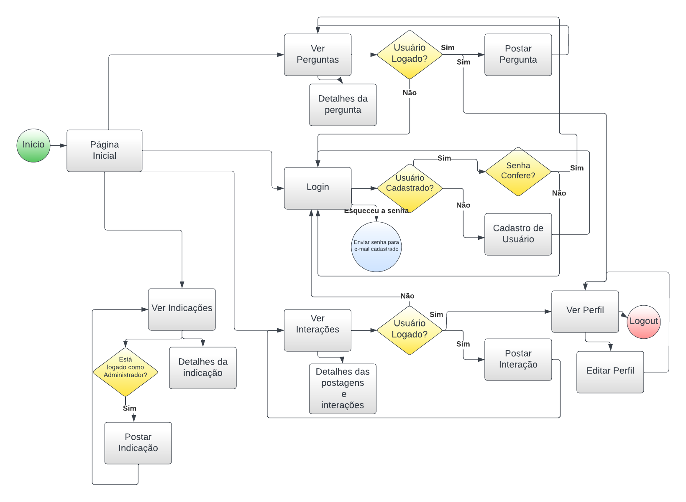

# Projeto de Interface

Para montagem da interface da aplicação estabelecemos como prioridade a acessibilidade, agilidade e usabilidade, mantendo um projeto visual mais sóbrio com foco no conteúdo. A aplicação manterá o seu padrão visual que atenderá a responsividade para desktops, tablets e smartphones.

## Diagrama de Fluxo

O diagrama de fluxo pode ser definido como a representação do fluxo sistemático dos dados, a fim de permitir o planejamento das interações e que o desenho do wireframe possa ser feito em seguida com mais qualidade. 

## Wireframes

São protótipos usados em design de interface para sugerir a estrutura de um site web e seu relacionamentos entre suas páginas. Um wireframe web é uma ilustração semelhante do layout de elementos fundamentais na interface.
 
> **Links Úteis**:
> - [Protótipos vs Wireframes](https://www.nngroup.com/videos/prototypes-vs-wireframes-ux-projects/)
> - [Ferramentas de Wireframes](https://rockcontent.com/blog/wireframes/)
> - [MarvelApp](https://marvelapp.com/developers/documentation/tutorials/)
> - [Figma](https://www.figma.com/)
> - [Adobe XD](https://www.adobe.com/br/products/xd.html#scroll)
> - [Axure](https://www.axure.com/edu) (Licença Educacional)
> - [InvisionApp](https://www.invisionapp.com/) (Licença Educacional)
