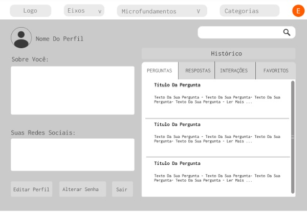
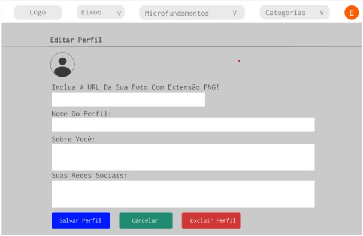

# Projeto de Interface

Pré-requisitos: <a href="2-Especificação do Projeto.md"> Documentação de Especificação</a>

Visão geral da interação do usuário pelas telas do sistema e protótipo interativo das telas com as funcionalidades que fazem parte do sistema (wireframes).

 Apresente as principais interfaces da plataforma. Discuta como ela foi elaborada de forma a atender os requisitos funcionais, não funcionais e histórias de usuário abordados nas <a href="2-Especificação do Projeto.md"> Documentação de Especificação</a>.

## Diagrama de Fluxo

O diagrama apresenta o estudo do fluxo de interação do usuário com o sistema interativo e  muitas vezes sem a necessidade do desenho do design das telas da interface. Isso permite que o design das interações seja bem planejado e gere impacto na qualidade no design do wireframe interativo que será desenvolvido logo em seguida.

O diagrama de fluxo pode ser desenvolvido com “boxes” que possuem internamente a indicação dos principais elementos de interface - tais como menus e acessos - e funcionalidades, tais como editar, pesquisar, filtrar, configurar - e a conexão entre esses boxes a partir do processo de interação. Você pode ver mais explicações e exemplos https://www.lucidchart.com/blog/how-to-make-a-user-flow-diagram.

As referências abaixo irão auxiliá-lo na geração do artefato “Diagramas de Fluxo”.

> **Links Úteis**:
> - [Fluxograma online: seis sites para fazer gráfico sem instalar nada | Produtividade | TechTudo](https://www.techtudo.com.br/listas/2019/03/fluxograma-online-seis-sites-para-fazer-grafico-sem-instalar-nada.ghtml)

## Wireframe Interativo

A apresentação das telas da aplicação terão uma estrutura similar à Figura 05 abaixo, a qual terá 3 blocos, dispostos da seguinte forma:

- **Cabeçalho -** nele estarão dispostos o logotipo da aplicação, uma barra com a lista de seleção por Eixo, Microfundamento, outra barra com a lista de seleção por Categoria e quando o usuário estiver logado haverá o elemento de identificação no lado direito superior identificando-o como usuário ativo.
- **Lateral Esquerda** - serão fixados os botões ou itens selecionáveis com as seguintes denominações: 
- ***Indicações:*** serão apresentados todos os Materiais Indicados pelos Administradores com conteúdo de apoio ou os filtrados por Eixo, Microfundamento e/ou Categoria selecionados no cabeçalho;
- ***Perguntas:*** serão apresentadas todas as perguntas ou as filtradas por Eixo, Microfundamento e/ou Categoria também selecionados no cabeçalho;
- ***Interações:*** ao selecionar esse item, serão apresentados os conteúdos postados pelos usuários cadastrados, com foco no compartilhamento de informações para a promoção do aprendizado conjunto da comunidade estudantil, podendo também serem  filtradas por Eixo, Microfundamento e/ou Categoria selecionados no cabeçalho.
- ***Botão de inclusão:*** de Perguntas, Conteúdos Interativos, Indicações e Respostas.  
- **Conteúdo -** neste bloco serão apresentadas as perguntas de acordo com o tema escolhido no cabeçalho, além disso, o usuário ainda contará com uma barra de pesquisa de texto livre, a fim de permitir buscas por palavras chaves, caso não tenha certeza em qual Eixo, Microfundamento ou Categoria a sua dúvida ou conteúdo se encaixaria. 

Figura 05 - Estrutura padrão do site

### Tela - Home-Page

A home-page da aplicação trará no seu cabeçalho além do logotipo, a barra de pesquisa de texto livre para permitir ao usuário fazer buscas por palavras chaves e os botões de Cadastre-se e Login.

Em um segundo bloco, logo abaixo do cabeçalho, o usuário já poderá fazer o filtro por Eixo, Microfundamento e/ou Categoria antes mesmo de clicar nas opções de navegação que estarão num bloco abaixo. Neste bloco o usuário poderá escolher entre Interações (Conteúdos publicados pelos próprios usuários), Perguntas (Questionamentos postados pelos usuários cadastrados) e Indicações (Materiais Publicados pelos Administradores.

Figura 06 - Tela - Home-Page

### Tela - Relação de Perguntas

Nesta tela será apresentado no Bloco de Conteúdo, as perguntas referentes ao Eixo, Microfundamento e/ou Categoria previamente selecionadas no cabeçalho. Como alternativa, o usuário poderá pesquisar na barra superior do mesmo bloco por palavras chaves, a fim de facilitar a usabilidade da aplicação pelos usuários e ampliar o seu acesso às informações. Cada pergunta encontrada permitirá a visualização das respostas compartilhadas, mesmo não estando logado. Caso queira interagir, bastará se cadastrar/logar na aplicação, podendo assim, responder as perguntas, reagir por meio de emojis, favoritar ou mesmo denunciar a postagem. 

O bloco lateral esquerdo permitirá que o usuário navegue entre Indicações, Perguntas e Interações, além de poder incluir perguntas ou publicar conteúdos, caso esteja logado, clicando no botão de “acrescer”.

Figura 07 - Tela Relação de Perguntas

### Tela - Visualização das Respostas

Ao identificar uma pergunta de seu interesse o usuário clicará no ícone “diálogo” logo abaixo da pergunta e terá acesso às respostas postadas. Caso o usuário esteja logado, poderá interagir por meio de emojis, favoritar a resposta, além de poder responder esta pergunta clicando no botão de “acrescer”. 

Figura 08 - Tela de Visualização das Respostas

### Tela - Visualização das Interações

O usuário chegará a esta tela clicando em “Interações” na Home-Page ou simplesmente clicando sobre a palavra em si nas telas de navegação dispostas no bloco lateral da esquerda. O usuário poderá fazer pesquisa por “Eixos”, “Microfundamentos” e “Categorias” no bloco cabeçalho ou mesmo por palavras chaves na barra de pesquisa superior do bloco conteúdo. Ao  identificar um assunto de seu interesse o usuário poderá clicar no ícone “diálogo” logo abaixo da descrição base do material e terá acesso aos comentários postados. Caso o usuário esteja logado, poderá interagir por meio de emojis, favoritar, além de poder comentar este conteúdo, clicando no botão de “acrescer”. 

Figura 09 - Tela de Visualização das Interações

### Tela - Visualização dos Comentários das Interações

O usuário irá visualizar nesta tela o conteúdo escolhido, além de ter acesso aos comentários postados. Para isso basta clicar no ícone “diálogo” logo abaixo para acessá-los. Caso o usuário esteja logado, poderá interagir por meio de emojis, favoritar o conteúdo, além de poder postar seu comentário, clicando no botão “acrescer”. 

Figura 10 - Tela de Visualização dos Comentários das Interações

### Tela - Visualização das Indicações

O usuário chegará a essa tela clicando em “Indicações” na Home-Page ou simplesmente clicando sobre a palavra em si nas telas de navegação no bloco lateral da esquerda. O usuário poderá fazer pesquisa por “Eixos”, “Microfundamentos” e “Categorias” dispostos no bloco cabeçalho ou mesmo por palavras chaves na barra de pesquisa superior do bloco conteúdo. Ao  identificar um material de seu interesse o usuário poderá clicar no ícone “diálogo” logo abaixo da descrição base do material e terá acesso aos comentários postados. Caso o usuário esteja logado, poderá interagir por meio de emojis, favoritar, além de poder comentar este material, clicando no botão de “acrescer”. 

Figura 11 - Tela de Visualização das Indicações

### Tela - Visualização dos Comentários das Indicações

O usuário irá visualizar nesta tela o material indicado, além de ter acesso aos comentários postados. Para isso basta clicar no ícone “diálogo” logo abaixo para acessá-los. Caso o usuário esteja logado, poderá interagir por meio de emojis, favoritar o conteúdo, além de poder postar seu comentário, clicando no botão “acrescer”. 

Figura 12 - Tela de Visualização dos Comentários das Indicações

### Tela - Cadastre-se

A tela de Cadastro, tem como pré requisito que o usuário seja aluno da Puc Minas. Desta forma, só serão permitidos usuários que tenham o E-mail com domínio @sga.pucminas.br.

Figura 13 - Tela Cadastre-se

### Tela - Login

Na tela de Login, o usuário entrará com o seu E-mail cadastrado na Puc Minas e uma Senha. Caso tenha esquecido sua senha, poderá clicar no “Esqueceu a senha?”, logo abaixo para recadastrá-la. 

Figura 14 - Tela de Login

### Tela - Esqueceu sua Senha

Na tela de Esqueceu sua Senha, o usuário digitará o seu Email e redefinirá sua senha.

Figura 15 - Esqueceu sua Senha

### Tela - Envie sua Pergunta

Nesta tela o usuário logado entrará com as informações preliminares de Categoria, Eixo, Microfundamento, Título da Pergunta e na sequência digitará sua pergunta e a enviará. 

Figura 16 - Tela de Envie sua Pergunta

### Tela - Compartilhe sua Resposta

Nesta tela o usuário logado responderá a pergunta em tela.

Figura 17 - Tela de Compartilhe sua Resposta

### Tela - Postagem de Interações

Na tela Postagem de Interações o usuário logado poderá fazer publicações de conteúdos, compartilhar informações que ele entenda ser de interesse da comunidade e que possam contribuir com o desenvolvimento coletivo. O mesmo deverá observar o preenchimento dos campos preliminares para que a aplicação possa direcionar os conteúdos adequadamente para os usuários. 

Figura 18 - Tela de Postagem de Interações

### Tela - Postagem de Indicações 

Nesta tela Indicações, somente os Administradores terão acesso, por se tratar de Material de Apoio indicado pelos Administradores da aplicação, ou seja, referenciado pelos mesmo como sendo material de alta relevância.

Figura 19 - Tela de Postagem de Indicações

### Tela - Perfil/Histórico de Interações

Nesta tela o usuário terá acesso ao seu perfil, onde poderá editá-lo, juntamente a seu histórico de interações, visualizando todas as  perguntas feitas, respostas dadas e publicações favoritadas.

Figura 20 - Perfil/Histórico de Interações

### Tela - Editar Perfil

Nesta tela o usuário poderá editar seu perfil, incluindo foto, dados pessoais e profissionais, suas redes sociais, tornando o ambiente mais personalizado. Nessa tela, poderá também trocar sua senha.

Figura 21 - Tela de Editar Perfil

