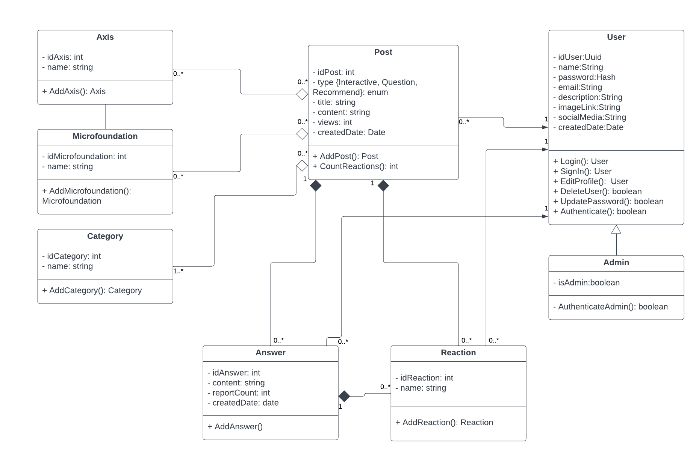
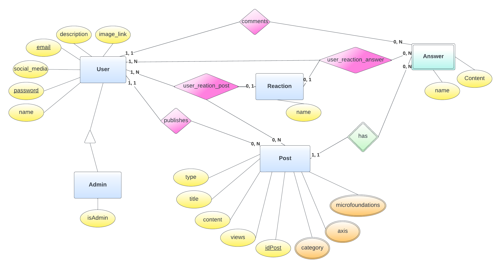

# Arquitetura da Solução

Definição de como o software é estruturado em termos dos componentes que fazem parte da solução e do ambiente de hospedagem da aplicação.

## Diagrama de Classes

O diagrama de classes ilustra graficamente como será a estrutura do software, e como cada uma das classes da sua estrutura estarão interligadas. Essas classes servem de modelo para materializar os objetos que executarão na memória.

## Modelo ER (Projeto Conceitual)

O Modelo ER representa através de um diagrama como as entidades se relacionam entre si na aplicação interativa.

## Projeto da Base de Dados

O projeto da base de dados corresponde à representação das entidades e relacionamentos identificadas no Modelo ER, no formato de tabelas, com colunas e chaves primárias/estrangeiras necessárias para representar corretamente as restrições de integridade.
 
Para mais informações, consulte o microfundamento "Modelagem de Dados".

 

## Tecnologias Utilizadas
 
 
 - IDEs de desenvolvimento: [Visual Studio Code](https://code.visualstudio.com/), e [Visual Studio 2022](https://visualstudio.microsoft.com/pt-br/);
 - Linguagens utilizadas: [HTML](https://developer.mozilla.org/pt-BR/docs/Web/HTML), [CSS](https://developer.mozilla.org/pt-BR/docs/Web/CSS), [JavaScript](https://developer.mozilla.org/pt-BR/docs/Web/JavaScript), [C#](https://learn.microsoft.com/pt-br/dotnet/csharp/tour-of-csharp/) e SQL;
 - Ferramentas de modelagem do banco de dados: [MySQL Workbench](https://www.mysql.com/products/workbench/);
 - Framework de ORM: [Entity](https://learn.microsoft.com/en-us/ef/);
 - Ferramenta de design: [Figma](https://www.figma.com/);
 - Plataforma para hospedagem do Site: [Github Pages](https://pages.github.com/).
 - Plataforma para hospedagem do banco de dados: [Microsoft SQL Server (Azure)](https://azure.microsoft.com/pt-br/products/azure-sql/?culture=pt-br&country=br#product-overview);
 - Ferramenta de versionamento: [Git](https://git-scm.com/);
  - Ferramenta de Diagramação: [Lucidchart](https://www.lucidchart.com/pages/pt);
 - Ferramenta de Gestão de Projeto: [Trello](https://trello.com/pt-BR).

 

## Hospedagem
 

O site do projeto é hospedado na plataforma gratuita **GitHub Pages**, que permite que os usuários publiquem sites estáticos diretamente de um repositório **GitHub**. O domínio utilizado é um subdomínio do github.io, fornecido gratuitamente pelo **GitHub**. Já para a hospedagem do banco de dados, é utilizado o serviço **Microsoft Azure**, que oferece recursos escaláveis de computação em nuvem. O banco de dados é hospedado no **Microsoft SQL Server**, e o acesso é feito utilizando o crédito fornecido pela **PUC Minas** para fins educacionais.
