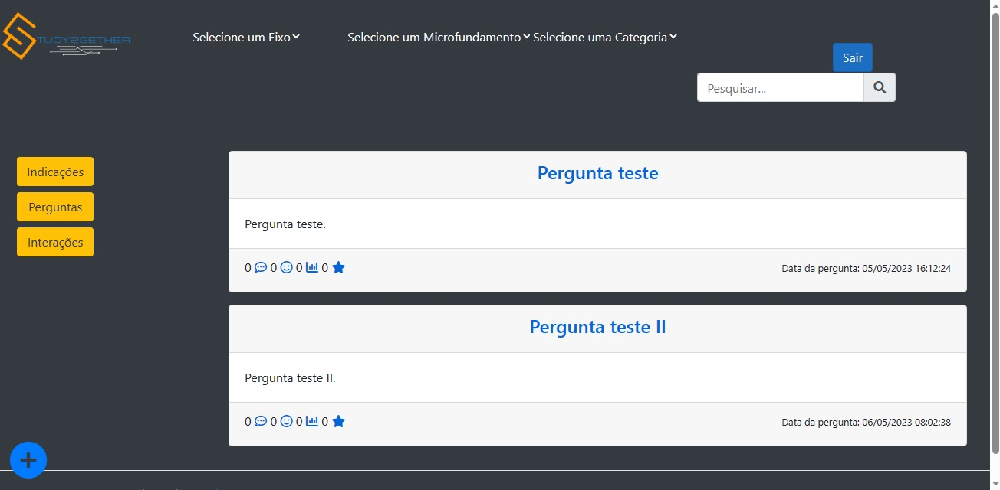
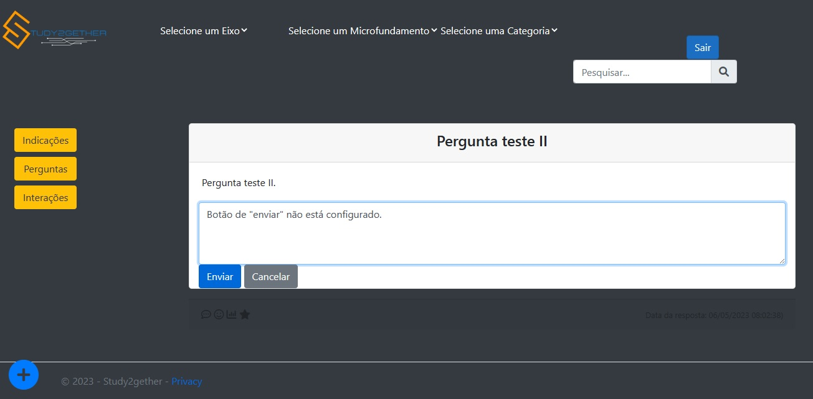

# Programação de Funcionalidades

Pré-requisitos: <a href="2-Especificação do Projeto.md"> Especificação do Projeto</a>, <a href="3-Projeto de Interface.md"> Projeto de Interface</a>, <a href="4-Metodologia.md"> Metodologia</a>, <a href="3-Projeto de Interface.md"> Projeto de Interface</a>, <a href="5-Arquitetura da Solução.md"> Arquitetura da Solução</a>

Implementação do sistema descrita por meio dos requisitos funcionais e/ou não funcionais. Deve relacionar os requisitos atendidos com os artefatos criados (código fonte), deverão apresentadas as instruções para acesso e verificação da implementação que deve estar funcional no ambiente de hospedagem.

### Funcionalidade 01: Fazer Publicações (RF-001)
A funcionalidade permite que o usuário faça uma postagem na pagina de Interações na platarforma da `Study2gether`.

##### Intruções de acesso
1. Acesse o site pelo [Link](https://github.com/ICEI-PUC-Minas-PMV-ADS/pmv-ads-2023-1-e2-proj-int-t2-pmv-ads-2023-1-e2-t2-time5-study2gether)
2. clicar em Interações
3. Clicar em '+' (usuários já cadastrados e previamente logados)

### Funcionalidade 02: Efetuar Cadastro	(RF-006)
A funcionalidade permite que o usuário realize com o cadastro na platarforma da `Study2gether`.

##### Intruções de acesso
1. Acesse o site pelo [Link](https://github.com/ICEI-PUC-Minas-PMV-ADS/pmv-ads-2023-1-e2-proj-int-t2-pmv-ads-2023-1-e2-t2-time5-study2gether)
2. Clique no botão `Cadastre-se`
3. Insira um `e-mail` com o formato `nome@sga.pucminas.br`
4. Insira uma `senha` com ao menos 8 caracteres
5. Clique no botão `Cadastrar`

##### Artefatos produzidos
* [Cadastro.cshtml](https://github.com/ICEI-PUC-Minas-PMV-ADS/pmv-ads-2023-1-e2-proj-int-t2-pmv-ads-2023-1-e2-t2-time5-study2gether/blob/main/src/Study2gether/Study2gether/Views/Users/Login.cshtml)
* [User.cs](https://github.com/ICEI-PUC-Minas-PMV-ADS/pmv-ads-2023-1-e2-proj-int-t2-pmv-ads-2023-1-e2-t2-time5-study2gether/blob/main/src/Study2gether/Study2gether/Models/User.cs)
* [UsersController.cs](https://github.com/ICEI-PUC-Minas-PMV-ADS/pmv-ads-2023-1-e2-proj-int-t2-pmv-ads-2023-1-e2-t2-time5-study2gether/blob/main/src/Study2gether/Study2gether/Controllers/UsersController.cs)

### Funcionalidade 03: Efetuar Login	(RF-006)
A funcionalidade permite que o usuário realize com sucesso o login na platarforma da `Study2gether`.

##### Intruções de acesso
1. Acesse o site pelo [Link](https://github.com/ICEI-PUC-Minas-PMV-ADS/pmv-ads-2023-1-e2-proj-int-t2-pmv-ads-2023-1-e2-t2-time5-study2gether)
2. Clique no botão `Login`
3. Insira `e-mail` e `senha` já cadastrados previamente
4. Clique no botão `Entrar`

### Funcionalidade 04: Visualizar publicações (RF-008)

A funcionalidade permite que os usuários visualizem as postagens de interações na platarforma da `Study2gether`.

##### Intruções de acesso
1. Acesse o site pelo [Link](https://github.com/ICEI-PUC-Minas-PMV-ADS/pmv-ads-2023-1-e2-proj-int-t2-pmv-ads-2023-1-e2-t2-time5-study2gether)
2. clicar em Interações

### Funcionalidade 05: Postar Perguntas (RF-003)
A aplicação deve permitir ao usuário postar perguntas na platarforma da `Study2gether`.

##### Intruções de acesso
1. Acesse o site pelo [Link](https://github.com/ICEI-PUC-Minas-PMV-ADS/pmv-ads-2023-1-e2-proj-int-t2-pmv-ads-2023-1-e2-t2-time5-study2gether)
2. clicar em "Perguntas"
3. Clicar em '+' (usuários já cadastrados e previamente logados)

##### Artefatos produzidos
* [Perguntas.cshtml] https://github.com/ICEI-PUC-Minas-PMV-ADS/pmv-ads-2023-1-e2-proj-int-t2-pmv-ads-2023-1-e2-t2-time5-study2gether/blob/develop/src/Study2gether/Study2gether/Views/Posts/Perguntas.cshtml
* [PostsController.cs] https://github.com/ICEI-PUC-Minas-PMV-ADS/pmv-ads-2023-1-e2-proj-int-t2-pmv-ads-2023-1-e2-t2-time5-study2gether/blob/develop/src/Study2gether/Study2gether/Controllers/PostsController.cs

### Funcionalidade 06: Postar Respostas (RF-004)
A aplicação deve permitir ao usuário responder as perguntas na platarforma da `Study2gether`.

##### Intruções de acesso
1. Acesse o site pelo [Link](https://github.com/ICEI-PUC-Minas-PMV-ADS/pmv-ads-2023-1-e2-proj-int-t2-pmv-ads-2023-1-e2-t2-time5-study2gether)
2. Clicar em "Perguntas"
3. Selecionar uma Pergunta
4. Clicar no local de inserir Respostas (usuários já cadastrados e previamente logados)
5. Digitar o texto
6. Clicar no botão "Enviar"

### Funcionalidade 07: Visualizar um histórico com as próprias ações (RF-007)
A funcionalidade permite que o usuário, logado na `Study2gether`, acesse sua página de perfil e visualize um histórico com suas ações de Perguntas, Interações, respostas e seus itens favoritados.

##### Intruções de acesso
1. Acesse o site pelo [Link](https://github.com/ICEI-PUC-Minas-PMV-ADS/pmv-ads-2023-1-e2-proj-int-t2-pmv-ads-2023-1-e2-t2-time5-study2gether)
2. Caso usuário não esteja com login efetuado, basta efetuar o `Login`
3. Com o login já efetuado, clicar em seu nome de usuário no canto superior direito
5. Na tela Perfil/Histórico, é possível interagir entre as abas para visualizar suas ações

##### Artefatos produzidos
* [Historico.cshtml](https://github.com/ICEI-PUC-Minas-PMV-ADS/pmv-ads-2023-1-e2-proj-int-t2-pmv-ads-2023-1-e2-t2-time5-study2gether/blob/main/src/Study2gether/Study2gether/Views/Users/Historico.cshtml)
* [User.cs](https://github.com/ICEI-PUC-Minas-PMV-ADS/pmv-ads-2023-1-e2-proj-int-t2-pmv-ads-2023-1-e2-t2-time5-study2gether/blob/main/src/Study2gether/Study2gether/Models/User.cs)
* [UsersController.cs](https://github.com/ICEI-PUC-Minas-PMV-ADS/pmv-ads-2023-1-e2-proj-int-t2-pmv-ads-2023-1-e2-t2-time5-study2gether/blob/main/src/Study2gether/Study2gether/Controllers/UsersController.cs)
* [Historico.js](https://github.com/ICEI-PUC-Minas-PMV-ADS/pmv-ads-2023-1-e2-proj-int-t2-pmv-ads-2023-1-e2-t2-time5-study2gether/blob/feature-96/src/Study2gether/Study2gether/wwwroot/js/historico.js)

### Funcionalidade 08: Editar o perfil de usuário (RF-007 e RF-006)
A funcionalidade permite que o usuário, logado na `Study2gether`, acesse seu perfil de usuário e edite suas informações de perfil.

##### Intruções de acesso
1. Acesse o site pelo [Link](https://user-images.githubusercontent.com/12260321/236688560-a4f53835-79c8-4227-b541-157af76215a0.png)
2. Caso usuário não esteja com login efetuado, basta efetuar o `Login`
3. Com o login já efetuado, clicar em seu nome de usuário no canto superior direito
4. Na tela Perfil/Histórico, clicar em `Editar Perfil`
5. Na tela de `Editar Perfil`, editar as informações
6. Clicar em `Salvar Perfil`. 

##### Artefatos produzidos
* [Historico.cshtml](https://github.com/ICEI-PUC-Minas-PMV-ADS/pmv-ads-2023-1-e2-proj-int-t2-pmv-ads-2023-1-e2-t2-time5-study2gether/blob/main/src/Study2gether/Study2gether/Views/Users/Historico.cshtml)
* [EditarPerfil.cshtml](https://github.com/ICEI-PUC-Minas-PMV-ADS/pmv-ads-2023-1-e2-proj-int-t2-pmv-ads-2023-1-e2-t2-time5-study2gether/blob/develop/src/Study2gether/Study2gether/Views/Users/EditarPerfil.cshtml)
* [EditarPerfil.css](https://github.com/ICEI-PUC-Minas-PMV-ADS/pmv-ads-2023-1-e2-proj-int-t2-pmv-ads-2023-1-e2-t2-time5-study2gether/blob/develop/src/Study2gether/Study2gether/wwwroot/css/editarPerfil.css)
* [User.cs](https://github.com/ICEI-PUC-Minas-PMV-ADS/pmv-ads-2023-1-e2-proj-int-t2-pmv-ads-2023-1-e2-t2-time5-study2gether/blob/main/src/Study2gether/Study2gether/Models/User.cs)
* [UsersController.cs](https://github.com/ICEI-PUC-Minas-PMV-ADS/pmv-ads-2023-1-e2-proj-int-t2-pmv-ads-2023-1-e2-t2-time5-study2gether/blob/main/src/Study2gether/Study2gether/Controllers/UsersController.cs)

### Funcionalidade 09: Excluir a conta (RF-006)
A funcionalidade permite que o usuário, logado na `Study2gether`, exclua sua conta de usuário.

##### Intruções de acesso
1. Acesse o site pelo [Link](https://user-images.githubusercontent.com/12260321/236688560-a4f53835-79c8-4227-b541-157af76215a0.png)
2. Caso usuário não esteja com login efetuado, basta efetuar o `Login`
3. Com o login já efetuado, clicar em seu nome de usuário no canto superior direito
4. Na tela Perfil/Histórico, clicar em `Editar Perfil`
5. Na tela de `Editar Perfil`, clicar em `Excluir Perfil`
6. Um prompt de confirmação será exibido informando que a exclusão será definitiva
7. Caso escolha `Sim`, a conta é definitivamente excluída e o usuário poderá fazer outro cadastro com esse email futuramente
8. Caso escolha `Cancelar`, a ação é abortada.

##### Artefatos produzidos
* [Historico.cshtml](https://github.com/ICEI-PUC-Minas-PMV-ADS/pmv-ads-2023-1-e2-proj-int-t2-pmv-ads-2023-1-e2-t2-time5-study2gether/blob/main/src/Study2gether/Study2gether/Views/Users/Historico.cshtml)
* [EditarPerfil.cshtml](https://github.com/ICEI-PUC-Minas-PMV-ADS/pmv-ads-2023-1-e2-proj-int-t2-pmv-ads-2023-1-e2-t2-time5-study2gether/blob/develop/src/Study2gether/Study2gether/Views/Users/EditarPerfil.cshtml)
* [EditarPerfil.css](https://github.com/ICEI-PUC-Minas-PMV-ADS/pmv-ads-2023-1-e2-proj-int-t2-pmv-ads-2023-1-e2-t2-time5-study2gether/blob/develop/src/Study2gether/Study2gether/wwwroot/css/editarPerfil.css)
* [User.cs](https://github.com/ICEI-PUC-Minas-PMV-ADS/pmv-ads-2023-1-e2-proj-int-t2-pmv-ads-2023-1-e2-t2-time5-study2gether/blob/main/src/Study2gether/Study2gether/Models/User.cs)
* [UsersController.cs](https://github.com/ICEI-PUC-Minas-PMV-ADS/pmv-ads-2023-1-e2-proj-int-t2-pmv-ads-2023-1-e2-t2-time5-study2gether/blob/main/src/Study2gether/Study2gether/Controllers/UsersController.cs)

### Funcionalidade 10: Alterar senha com usuário logado (RF-010)
A funcionalidade permite que o usuário logado na `Study2gether` acesse seu Perfil e altere sua senha.

##### Intruções de acesso
1. Acesse o site pelo [Link](https://github.com/ICEI-PUC-Minas-PMV-ADS/pmv-ads-2023-1-e2-proj-int-t2-pmv-ads-2023-1-e2-t2-time5-study2gether)
2. Caso usuário não esteja com login efetuado, basta efetuar o `Login`
3. Com o login já efetuado, clicar em seu nome de usuário no canto superior direito
4. Na tela Perfil/Histórico, clicar em `Alterar senha`
5. Na tela `Alterar Senha`, inserir qual a senha atual, qual será a senha nova e confirmar a nova senha
6. Clicar em `Alterar Senha`.

##### Artefatos produzidos
* [Historico.cshtml](https://github.com/ICEI-PUC-Minas-PMV-ADS/pmv-ads-2023-1-e2-proj-int-t2-pmv-ads-2023-1-e2-t2-time5-study2gether/blob/main/src/Study2gether/Study2gether/Views/Users/Historico.cshtml)
* [AlterarSenha.cshtml](https://github.com/ICEI-PUC-Minas-PMV-ADS/pmv-ads-2023-1-e2-proj-int-t2-pmv-ads-2023-1-e2-t2-time5-study2gether/blob/develop/src/Study2gether/Study2gether/Views/Users/AlterarSenha.cshtml)
* [EditarPerfil.css](https://github.com/ICEI-PUC-Minas-PMV-ADS/pmv-ads-2023-1-e2-proj-int-t2-pmv-ads-2023-1-e2-t2-time5-study2gether/blob/develop/src/Study2gether/Study2gether/wwwroot/css/editarPerfil.css)
* [User.cs](https://github.com/ICEI-PUC-Minas-PMV-ADS/pmv-ads-2023-1-e2-proj-int-t2-pmv-ads-2023-1-e2-t2-time5-study2gether/blob/main/src/Study2gether/Study2gether/Models/User.cs)
* [UsersController.cs](https://github.com/ICEI-PUC-Minas-PMV-ADS/pmv-ads-2023-1-e2-proj-int-t2-pmv-ads-2023-1-e2-t2-time5-study2gether/blob/main/src/Study2gether/Study2gether/Controllers/UsersController.cs)
