# Registro de Testes de Software

Pré-requisitos: <a href="3-Projeto de Interface.md"> Projeto de Interface</a>, <a href="8-Plano de Testes de Software.md"> Plano de Testes de Software</a>

## Avaliação
| **ID** | **Descrição do teste** | **Descrição do resultado** | **Gravidade** |
|:---: |:---: |:---: |:---: |
| CT-01 - RF-06 | Verificar se o usuário consegue se cadastrar na aplicação. 
| Registro da tela: |  | Data do Teste: 06/05/2023 - Resultado: Positivo - O cadastro foi realizado com sucesso. | Alta |

| **ID** | **Descrição do teste** | **Descrição do resultado** | **Gravidade** |
|:---: |:---: |:---: |:---: |
| CT-02 - RF-06 | Verificar se é impossível se cadastrar duas vezes com o mesmo e-mail. 
| Registro da tela:|  | Data do Teste: 06/05/2023 - Resultado: Positivo - Aparece uma mensagem de erro informando que o usuário ja foi cadastrado | Alta | 

| **ID** | **Descrição do teste** | **Descrição do resultado** | **Gravidade** |
|:---: |:---: |:---: |:---: |
| CT-03 - RF-06 | Verificar se o usuário consegue realizar o Login na aplicação. 
| Registro da tela:|  | Data do Teste: 06/05/2023 - Resultado: Positivo - O Login foi realizado com sucesso. | Alta | 

| **ID** | **Descrição do teste** | **Descrição do resultado** | **Gravidade** |
|:---: |:---: |:---: |:---: |
| CT-04 - RF-06 | Verificar se o sistema impede a realização de login com campos em branco ou inválidos. 
| Registro da tela:|  | Data do Teste: 06/05/2023 - Resultado: Positivo - Aparece uma mensagem de erro caso todos os campos obrigatórios não estejam preenchidas. | Media |  

| **ID** | **Descrição do teste** | **Descrição do resultado** | **Gravidade** |
|:---: |:---: |:---: |:---: |
| CT-05 - RF-10 | Verificar se o usuário cadastrado consegue redefinir sua senha esquecida. |    |    |
| Registro da tela: |  | Data do Teste: 03/06/2023 - Resultado Positivo - A aplicação respondeu com um pop-up com uma mensagem "Caso o e-mail exista, você receberá um email com mais instruções em breve!" ao Clicar no Botão "Redefinir a senha". | Média |

| **ID** | **Descrição do teste** | **Descrição do resultado** | **Gravidade** |
|:---: |:---: |:---: |:---: |
| CT-06 - RF-10 | Verificar se a aplicação impede a recuperação de senha com um e-mail inválido. |    |    |
| Registro da tela: |  | Data do Teste: 03/06/2023 - Resultado Positivo - A aplicação respondeu com um pop-up com uma mensagem "Caso o e-mail exista, você receberá um email com mais instruções em breve!" ao Clicar no Botão "Redefinir a senha".  | Média |

| **ID** | **Descrição do teste** | **Descrição do resultado** | **Gravidade** |
|:---: |:---: |:---: |:---: |
| CT-07 - RF-02 | Verificar se o filtro por Eixo está fazendo a busca correta de Perguntas por Eixo. |    |    |
| Registro da tela: |  | Data do Teste: 06/05/2023 - Resultado: NEGATIVO - Os Eixos ainda não foram inseridos para que o usuário possa selecioná-los. | Grave |
| Registro da tela: |  | Data do Teste: 21/05/2023 - Resultado: NEGATIVO - A filtragem de Perguntas por Eixo ainda não está funcionando. Ação: Implementar a funcionalidade. | Grave |
| Registro da tela: | 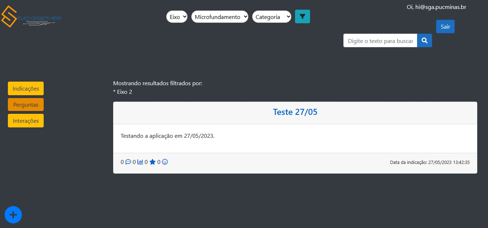 | Data do Teste: 27/05/2023 - Resultado: POSITIVO - O usuário consegue filtrar as perguntas por Eixo. | Sucesso |

| **ID** | **Descrição do teste** | **Descrição do resultado** | **Gravidade** |
|:---: |:---: |:---: |:---: |
| CT-08 - RF-02 | Verificar se o filtro por Microfundamento está fazendo a busca correta de Perguntas por este Microfundamento. |    |    |
| Registro da tela: |  | Data do Teste: 06/05/2023 - Resultado: NEGATIVO - Os Microfundamentos ainda não foram inseridos para que o usuário possa selecioná-los. | Grave |
| Registro da tela: |  | Data do Teste: 21/05/2023 - Resultado: NEGATIVO - A filtragem de Perguntas por Microfundamento ainda não está funcionando. Ação: Implementar a funcionalidade. | Grave |
| Registro da tela: | 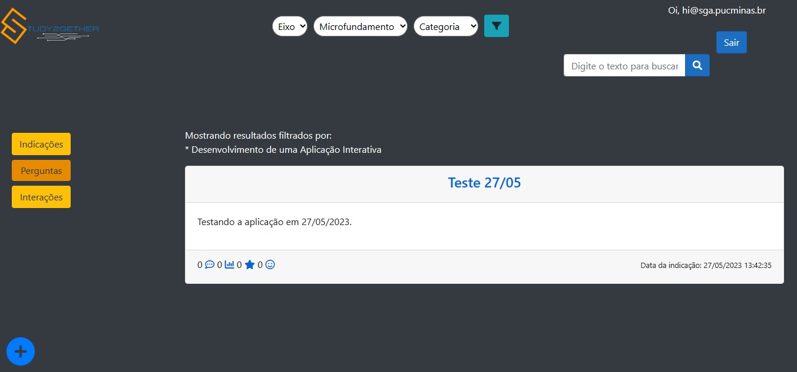 | Data do Teste: 27/05/2023 - Resultado: POSITIVO - O usuário consegue filtrar as perguntas por Microfundamento. | Sucesso |

| **ID** | **Descrição do teste** | **Descrição do resultado** | **Gravidade** |
|:---: |:---: |:---: |:---: |
| CT-09 - RF-02 | Verificar se o filtro por Categoria está fazendo a busca correta de Perguntas por essa categoria. | | |
| Registro da tela: | 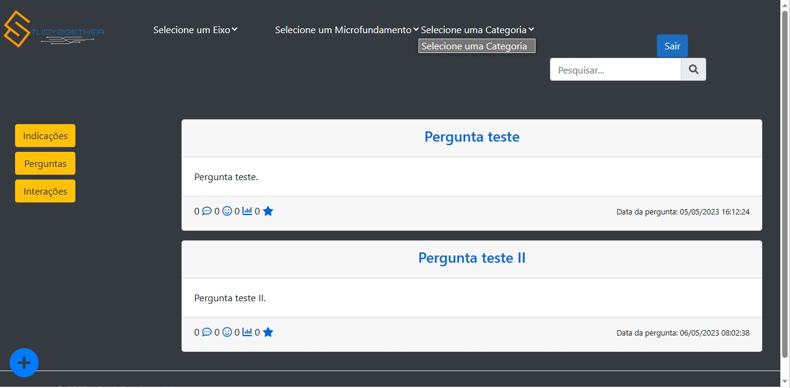 | Data do Teste: 06/05/2023 - Resultado: NEGATIVO - As Categorias ainda não foram inseridas para que o usuário possa selecioná-las. | Grave |
| Registro da tela: |  | Data do Teste: 21/05/2023 - Resultado: NEGATIVO - A filtragem de Perguntas por Categoria ainda não está funcionando. Ação: Implementar a funcionalidade.| Grave |
| Registro da tela: | 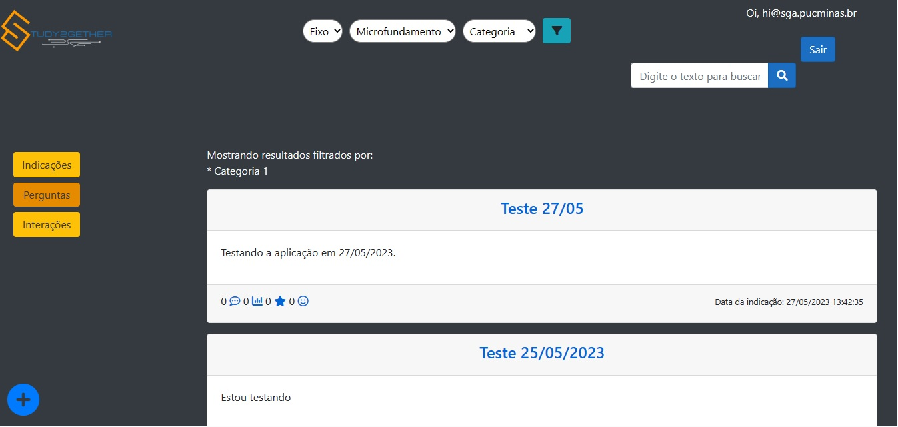 | Data do Teste: 27/05/2023 - Resultado: POSITIVO - O usuário consegue filtrar as perguntas por Categoria. | Sucesso |

| **ID** | **Descrição do teste** | **Descrição do resultado** | **Gravidade** |
|:---: |:---: |:---: |:---: |
| CT-10 - RF-02 | Verificar se o filtro por Eixo está fazendo a busca correta de Interações por Eixo. |    |    |
| Registro da tela: | | Data do Teste: 21/05/2023 - Resultado: NEGATIVO - A página de Interações não pode ser acessada por uma excessão apontada, impossibilitando o teste de filtragem de Interações por Eixo. Ação: Tratar primeiro a excessão apontada e então testar se a filtragem está sendo apresentada corretamente.| Grave |
| Registro da tela:||Data do Teste: 26/05/2023 - Resultado: POSITIVO - A funcionalidade foi completamente implementada, sendo possivel ver as postagens pelo filtro de Eixo, e antes das postagens é apresentado qual filtro está ativo.| Sucesso |

| **ID** | **Descrição do teste** | **Descrição do resultado** | **Gravidade** |
|:---: |:---: |:---: |:---: |
| CT-11 - RF-02 | Verificar se o filtro por Microfundamento está fazendo a busca correta de Interações por este Microfundamento. |    |    |
| Registro da tela: ||Data do Teste: 26/05/2023 - Resultado: POSITIVO - A funcionalidade foi completamente implementada, sendo possivel ver as postagens pelo filtro de Microfundamento, e antes das postagens é apresentado qual filtro está ativo.|Sucesso.|

| **ID** | **Descrição do teste** | **Descrição do resultado** | **Gravidade** |
|:---: |:---: |:---: |:---: |
| CT-12 - RF-02 | Verificar se o filtro por Categoria está fazendo a busca correta de Interações por essa Categoria. |    |    |
| Registro da tela: ||Data do Teste: 26/05/2023 - Resultado: POSITIVO - A funcionalidade foi completamente implementada, sendo possivel ver as postagens pelo filtro de Categoria, e antes das postagens é apresentado qual filtro está ativo.|Sucesso|

| **ID** | **Descrição do teste** | **Descrição do resultado** | **Gravidade** |
|:---: |:---: |:---: |:---: |
| CT-13 - RF-02 | Verificar se o filtro por Eixo está fazendo a busca correta de Indicações por Eixo. | | |
| Registro da tela: ||Data do Teste: 06/05/2023 - Resultado: NEGATIVO - A funcionalidade dos filtros de pesquisa ainda não foram implementada.| Alta|
| Registro da tela: |  | Data do Teste: 21/05/2023 - Resultado: NEGATIVO - A filtragem de Indicações por Eixo ainda não está funcionando. Ação: Implementar a funcionalidade.| Grave |
| Registro da tela: ||Data do Teste: 26/05/2023 - Resultado: POSITIVO - A funcionalidade foi completamente implementada, sendo possivel ver as postagens pelo filtro de eixo, e antes das postagens é apresentado qual filtro está ativo.| Sucesso |

| **ID** | **Descrição do teste** | **Descrição do resultado** | **Gravidade** |
|:---: |:---: |:---: |:---: |
| CT-14 - RF-02 | Verificar se o filtro por Microfundamento está fazendo a busca correta de Indicações por Microfundamento. |    |    |
| Registro da tela: |  | Data do Teste: 21/05/2023 - Resultado: NEGATIVO - A filtragem de Indicações por Microfundamento ainda não está funcionando. Ação: Implementar a funcionalidade.| Grave |
| Registro da tela: ||Data do Teste: 26/05/2023 - Resultado: POSITIVO - A funcionalidade foi completamente implementada, sendo possivel ver as postagens pelo filtro de microfundamento, e antes das postagens é apresentado qual filtro está ativo.| Sucesso |

| **ID** | **Descrição do teste** | **Descrição do resultado** | **Gravidade** |
|:---: |:---: |:---: |:---: |
| CT-15 - RF-02 | Verificar se o filtro por Categoria está fazendo a busca correta de Indicações por essa categoria. |    |    |
| Registro da tela:| |Data do Teste: 06/05/2023 - Resultado: NEGATIVO - A funcionalidade dos filtros de pesquisa ainda não foram implementada.| Alta|
| Registro da tela: |  | Data do Teste: 21/05/2023 - Resultado: NEGATIVO - A filtragem de Indicações por Categoria ainda não está funcionando. Ação: Implementar a funcionalidade.| Grave |
| Registro da tela:||Data do Teste: 26/05/2023 - Resultado: POSITIVO - A funcionalidade foi completamente implementada, sendo possivel ver as postagens pelo filtro de categoria, e antes das postagens é apresentado qual filtro está ativo.| Sucesso |

| **ID** | **Descrição do teste** | **Descrição do resultado** | **Gravidade** |
|:---: |:---: |:---: |:---: |
| CT-16 - RF-05 | Verificar se a busca de perguntas por palavra chave digitada na barra de pesquisa está trazendo o resultado correto. |    |    |
| Registro da tela: |  | Data do Teste: 06/05/2023 - Resultado: NEGATIVO - O botão de pesquisa não está funcionando. | Grave |
| Registro da tela: |  | Data do Teste: 21/05/2023 - Resultado: NEGATIVO - Ao fazer pesquisa com palavras chaves, como por exemplo "adequadamente" a aplicação até buscou as postagens que apresentam essa palavra, no entanto buscou do banco de dados de "Interações" | Grave |
| Registro da tela: | | Data do Teste: 24/05/2023 - Resultado: POSITIVO -  O campo de pesquisa está funcionando perfeitamente. Foi inserido a palavra css e feito uma busca em titulo e conteudo, e foi mostrado apenas as publicações que continham o texto pesquisado. | Baixa |
| Registro da tela: | 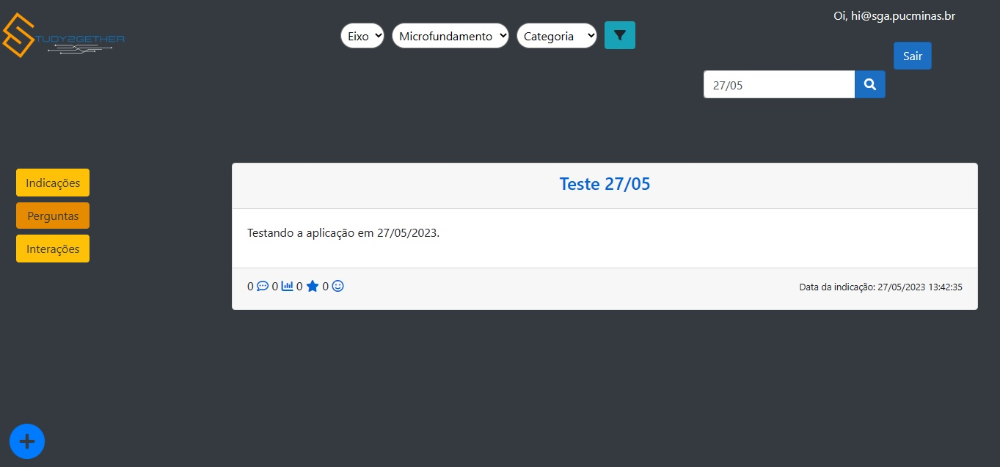 | Data do Teste: 27/05/2023 - Resultado: POSITIVO - O usuário consegue realizar uma pesquisa de busca por palavra chave na barra de pesquisa. | Sucesso |

| **ID** | **Descrição do teste** | **Descrição do resultado** | **Gravidade** |
|:---: |:---: |:---: |:---: |
| CT-17 - RF-05 | Verificar se a busca de interações por palavra chave digitada na barra de pesquisa está trazendo o resultado correto. |    |    |
| Registro da tela:| | Data do Teste: 06/05/2023 - Resultado: NEGATIVO - A funcionalidade dos filtros de pesquisa ainda não foram implementada.| Alta|
| Registro da tela:|  | Data do Teste: 21/05/2023 - Resultado: NEGATIVO - A página de Interações não pode ser acessada por uma excessão apontada, impossibilitando o teste de filtragem de Interações por por palavra chave. Ação: Tratar primeiro a excessão apontada e então testar se a filtragem por palavra chave.| Grave |
| Registro da tela:| |Data do Teste: 24/05/2023 - Resultado: POSITIVO -  O campo de pesquisa está funcionando perfeitamente. Foi inserido a palavra teste e feito uma busca em titulo e conteudo, e foi mostrado apenas as publicações que continham o texto pesquisado.| Sucesso |

| **ID** | **Descrição do teste** | **Descrição do resultado** | **Gravidade** |
|:---: |:---: |:---: |:---: |
| CT-18 - RF-05 | Verificar se a busca de indicações por palavra chave digitada na barra de pesquisa está trazendo o resultado correto.   |    |    |
| Registro da tela: | | Data do Teste: 21/05/2023 - Resultado: NEGATIVO - Ao fazer pesquisa com palavras chaves, como por exemplo "Testando" a aplicação buscou todas as postagens que apresentam essa palavra, no entanto buscou do banco de dados de "Interações". Ação: Corrigir a função de busca. | Grave |
| Registro da tela: | | Data do Teste: 01/06/2023 - Resultado: POSITIVO - Ao fazer pesquisa com palavras chaves, como por exemplo "C#" a aplicação buscou todas as postagens que apresentam essa palavra, na área de "Interações". | Sucesso |

| **ID** | **Descrição do teste** | **Descrição do resultado** | **Gravidade** |
|:---: |:---: |:---: |:---: |
| CT-19 - RF-03 | Verificar se usuário consegue postar uma pergunta. |    |    |
| Registro da tela: | 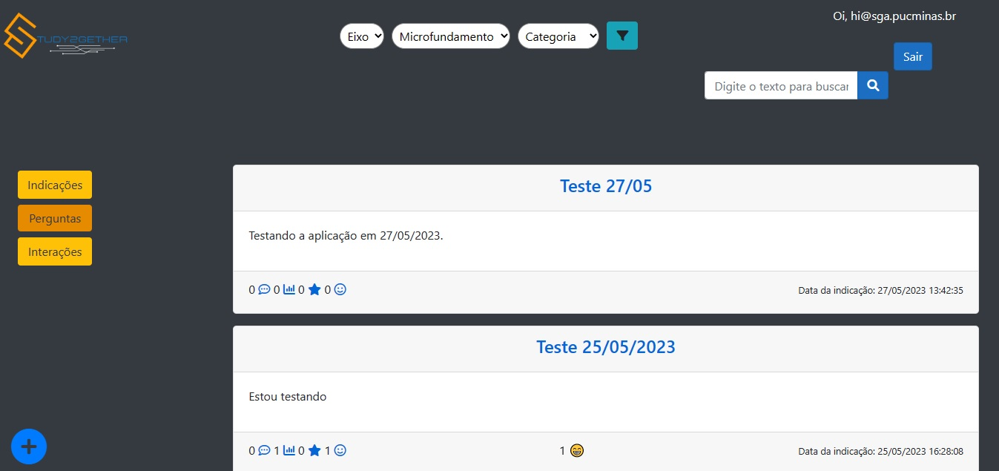 | Data do Teste: 27/05/2023 - Resultado: POSITIVO - O usuário consegue realizar a postagem de perguntas. | Sucesso |

| **ID** | **Descrição do teste** | **Descrição do resultado** | **Gravidade** |
|:---: |:---: |:---: |:---: |
| CT-20 - RF-03 | Verificar se a aplicação impede que o usuário poste perguntas sem os campos obrigatórios, “Categoria”, “Título” e "Pergunta". |    |    |
| Registro da tela: | 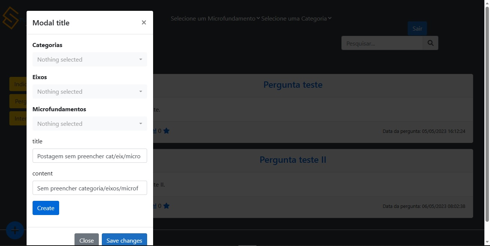 | Data do Teste: 06/05/2023 - Resultado: NEGATIVO - O usuário consegue realizar a postagem de perguntas sem selecionar os campos “Categoria”, “Eixo”, “Microfundamento” e “Título”. | Grave |
| Registro da tela: |  | Data do Teste: 21/05/2023 - Resultado: POSITIVO - O usuário não consegue realizar a postagem de perguntas. | Grave |
| Registro da tela: | 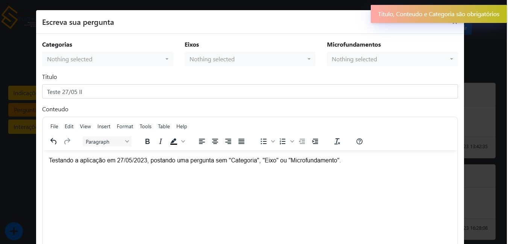 | Data do Teste: 27/05/2023 - Resultado: POSITIVO - O usuário não consegue realizar a postagem de perguntas sem selecionar os campos “Categoria”, “Título” e "Conteúdo". | Sucesso |
| Registro da tela: | 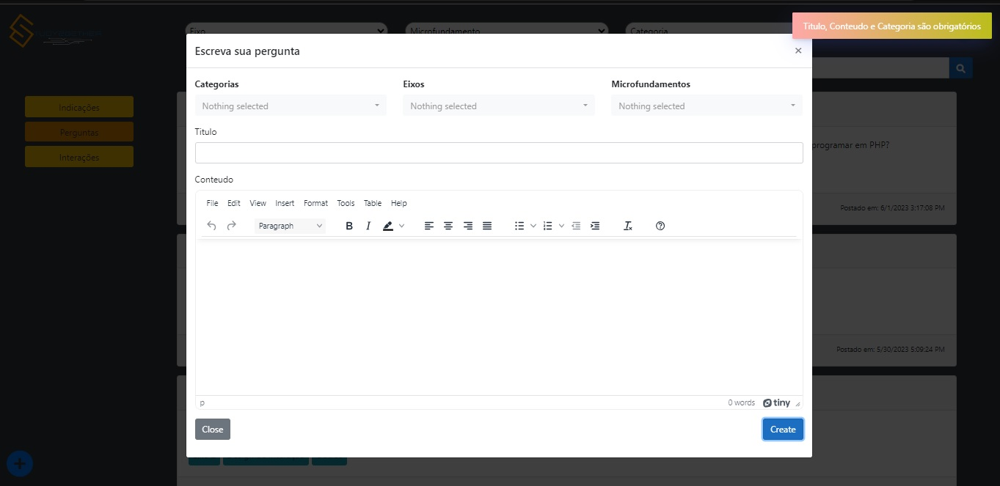 | Data do Teste: 02/06/2023 - Resultado: POSITIVO - O usuário não consegue realizar a postagem de perguntas sem selecionar os campos “Categoria”, “Título” e "Conteúdo", a aplicação impede que o usuário poste perguntas sem preencher todos os campos obrigatórios. | Sucesso |

| **ID** | **Descrição do teste** | **Descrição do resultado** | **Gravidade** |
|:---: |:---: |:---: |:---: |
| CT-21 - RF-04 | Verificar se as respostas serão apresentadas corretamente junto às perguntas. |    |    |
| Registro da tela: |  | Data do Teste: 05/05/23 - Resultado Negativo - Não foi possível verificar se as respostas foram apresentadas corretamente.  | Grave |
| Registro da tela: |  | Data do Teste: 21/05/23 - Resultado POSITIVO - Foi possível visualizar as respostas postadas anteriormente para aquela pergunta.  | - |

| **ID** | **Descrição do teste** | **Descrição do resultado** | **Gravidade** |
|:---: |:---: |:---: |:---: |
| CT-22 - RF-04 | Verificar se o campo de comentários no rodapé das interações está registrando adequadamente os comentários feitos. |    |    |
| Registro da tela: |  | Data do Teste: 05/05/23 - Resultado Negativo - Não foi possÍvel verificar se o campo de comentários está registrando adequadamente os comentários feitos. | Grave |   
| Registro da tela: |  | Data do Teste: 21/05/2023 - Resultado: NEGATIVO - A página de Interações não pode ser acessada por uma excessão apontada, impossibilitando a verificação se os comentários estão sendo apresentados abaixo do conteúdo publicado adequadamente. Ação: Tratar primeiro a excessão apontada e então verificar se os comentários estão sendo apresentados corretamente.| Grave |

| **ID** | **Descrição do teste** | **Descrição do resultado** | **Gravidade** |
|:---: |:---: |:---: |:---: |
| CT-23 - RF-04 | Verificar se o campo de comentários no rodapé das indicações está registrando adequadamente os comentários feitos. |    |    |
| Registro da tela: |  | Data do Teste: 05/05/23 - Resultado Negativo - Não foi possível verificar se o campo de comentários das indicações está registrando adequadamente os comentários feitos. | Grave | 
| Registro da tela: |  | Data do Teste: 21/05/23 - Resultado NEGATIVO - O registro do comentário feito no campo indicado no rodapé das indicações não foi apresentado junto aos comentários feitos anteriormente. Ação: Revisar o código e corrigí-lo | Grave | 

| **ID** | **Descrição do teste** | **Descrição do resultado** | **Gravidade** |
|:---: |:---: |:---: |:---: |
| CT-24 - RF-01 | Verificar se as publicações estão sendo apresentadas na "Lista de Interações". |    |    |
| Registro da tela: ||Data do teste: 06/05/2023 - Resultado Positivo - As publicações de interações estão sendo apresentadas na pagina correta.|Baixa|
| Registro da tela: |  | Data do Teste: 21/05/2023 - Resultado: NEGATIVO - A página de Interações não pode ser acessada por uma excessão apontada, impossibilitando verificar se as postagens de interações estão sendo apresentadas na "Lista" corretamente. Ação: Tratar primeiro a excessão apontada e então verificar se as postagens são apresentadas corretamente. | Grave |
| Registro da tela: |  | Data do Teste: 01/06/2023 - Resultado: POSITIVO - A página de Interações apresentou corretamente na sua listagem as postagens corretas. | Sucesso |

| **ID** | **Descrição do teste** | **Descrição do resultado** | **Gravidade** |
|:---: |:---: |:---: |:---: |
| CT-25 - RF-01 | Verificar se aplicação impede que o usuário poste conteúdos sem preencher todos os campos obrigatórios de “Categoria”, “Título” e "Conteúdo". |    |    |
| Registro da tela: | 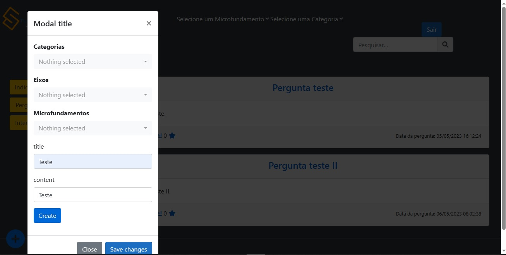 | Data do Teste: 06/05/2023 - Resultado: NEGATIVO - O usuário consegue realizar a postagem de conteúdos sem selecionar os campos “Categoria”, “Título” e "Conteúdo", a aplicação não impede que o usuário poste conteúdos sem preencher todos os campos obrigatórios. | Grave |
| Registro da tela: |  | Data do Teste: 21/05/2023 - Resultado: NEGATIVO - A página de Interações não pode ser acessada por uma excessão apontada, não sendo possível efetuar o teste de postagem de conteúdo "Interações". Ação: Tratar primeiro a excessão apontada e então verificar se está sendo possível registrar Interações mesmo sem preencher os campos obrigatórios. | Grave |
| Registro da tela: | 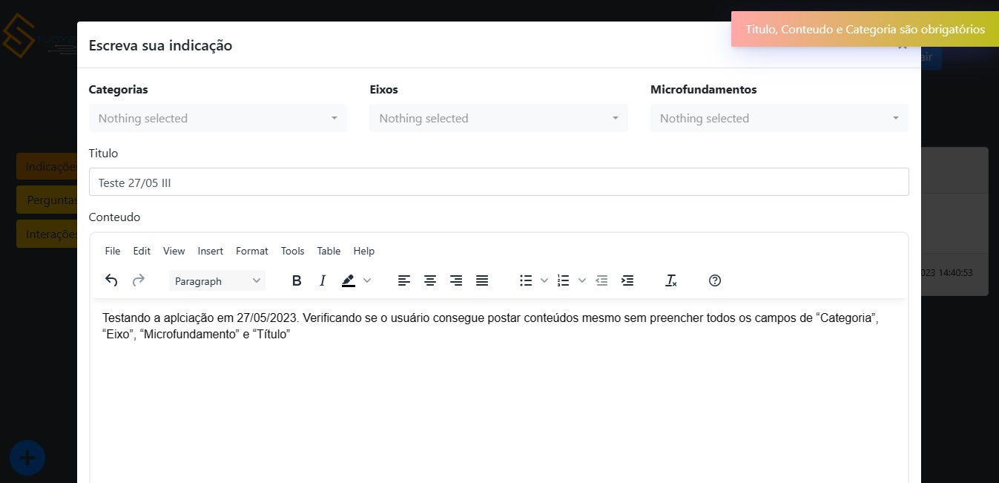 | Data do Teste: 27/05/2023 - Resultado: POSITIVO - O usuário não consegue realizar a postagem de conteúdos sem selecionar os campos “Categoria”, “Título” e "Conteúdo", aplicação impede que o usuário poste conteúdos sem preencher todos os campos obrigatórios. | Sucesso |
| Registro da tela: | 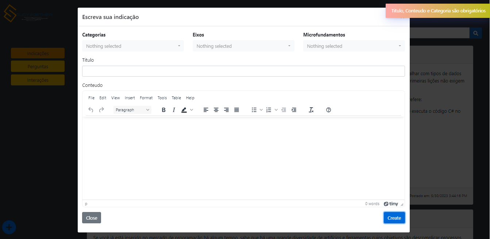 | Data do Teste: 01/06/2023 - Resultado: POSITIVO - O usuário não consegue realizar a postagem de conteúdos sem selecionar os campos “Categoria”, “Título” e "Conteúdo", a aplicação impede que o usuário poste conteúdos sem preencher todos os campos obrigatórios. | Sucesso |

| **ID** | **Descrição do teste** | **Descrição do resultado** | **Gravidade** |
|:---: |:---: |:---: |:---: |
| CT-26 - RF-11 | Verificar se as postagens de indicações estão sendo apresentadas na "Lista de Indicações". |    |    |
| Registro da tela: |  | Resultado Positivo - As postagens foram devidamente apresentadas - Data do Teste: 06/05/2023 | Sucesso 
| Registro da tela: |  | Data do Teste: 21/05/2023 - Resultado Positivo - As postagens foram apresentadas corretamente | Sucesso |

| **ID** | **Descrição do teste** | **Descrição do resultado** | **Gravidade** |
|:---: |:---: |:---: |:---: |
| CT-27 - RF-11 | Verificar se a aplicação impede que o usuário poste conteúdos sem preencher todos os campos obrigatórios de “Categoria”, “Título” e "Conteúdo". |   |   |    
| Registro da tela: |  | Resultado Negativo - A aplicação não permitiu a postagem da indicação, mas não retornou nenhum erro ou aviso sobre os campos obrigatórios - Data do Teste: 06/05/2023 | Baixa |
| Registro da tela: |  | Data do Teste: 21/05/2023 - Resultado Negativo - A aplicação não restringiu a postagem da indicação faltando dados obrigatórios. Ação: Implementar "Restrições" e informar o usuário da necessidade de preencher os campos obrigatórios. | Grave |
| Registro da tela: |  | Data do Teste: 01/06/2023 - Resultado Positivo - A aplicação restringiu a postagem da indicação faltando dados obrigatórios e apresentou um popup acusando a necessidade do preenchimento. | Sucesso |

| **ID** | **Descrição do teste** | **Descrição do resultado** | **Gravidade** |
|:---: |:---: |:---: |:---: |
| CT-28 - RF-09 | Verificar se os emojis estão sendo ativados corretamente ao reagir às Perguntas. |    |    |
| Registro da tela: | 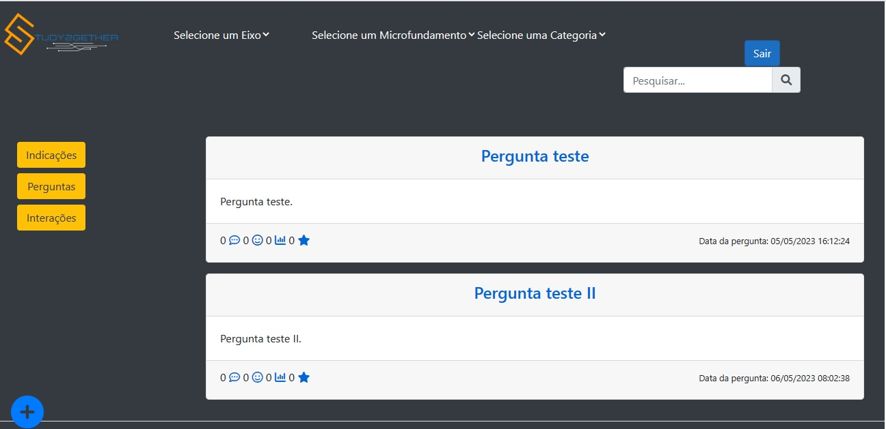 | Data do Teste: 06/05/2023 - Resultado: NEGATIVO - O usuário não consegue reagir às perguntas com emojis. | Grave |
| Registro da tela: | | Data do Teste: 16/05/23 - Resultado Positivo - O usuário pode reagir às Perguntas com emojis | - | 
| Registro da tela: |  | Data do Teste: 27/05/2023 - Resultado: POSITIVO - O usuário consegue reagir às perguntas com emojis. | Sucesso |

| **ID** | **Descrição do teste** | **Descrição do resultado** | **Gravidade** |
|:---: |:---: |:---: |:---: |
| CT-29 - RF-09 | Verificar se os emojis estão sendo ativados corretamente ao reagir às Interações. |    |    |
| Registro da tela: || Data do teste: 06/05/2023 - Os emojis estão sendo contabilizados corretamente, mas passará por nova validação| Média |
| Registro da tela: |  | Data do Teste: 21/05/2023 - Resultado: NEGATIVO - A página de Interações não pode ser acessada por uma excessão apontada, não sendo possível verificar se os emojis estão sendo ativados corretamente ao reagir às "Interações". Ação: Tratar primeiro a excessão apontada e então verificar se a reação com emojis está sendo ativada corretamente. | Grave |
| Registro da tela: || Data do teste: 26/05/2023 - Resultado: POSITIVO - Os emojis estão sendo contabilizados corretamente, e é possivel visualizar os emojis que foram adicionados no footer da publicação.| Sucesso |

| **ID** | **Descrição do teste** | **Descrição do resultado** | **Gravidade** |
|:---: |:---: |:---: |:---: |
| CT-30 - RF-09 | Verificar se os emojis estão sendo ativados corretamente ao regir às Indicações. |    |    |
| Registro da tela: |  | Data do Teste: 05/05/23 - Resultado Negativo - Foi possivel reagir a publicação, mas as unicas opções eram estrela e sorriso | Baixa |
| Registro da tela: |  | Data do Teste: 21/05/23 - Resultado POSITIVO - Foi possível reagir a publicação com o Emoji escolhido. | Sucesso |

| **ID** | **Descrição do teste** | **Descrição do resultado** | **Gravidade** |
|:---: |:---: |:---: |:---: |
| CT-31 - RF-08 | Verificar se a aplicação está apresentando todas as Perguntas com as respectivas Respostas para todos os usuários, logados ou não. |    |    |
| Registro da tela: |  | Data do Teste: 06/05/2023 - Resultado: NEGATIVO - O botão "Enviar" não está funcionando, logo não é possível enviar respostas para realizar o teste. | Grave |
| Registro da tela: | | Data do Teste: 21/05/2023 - Resultado: POSITIVO - As respostas estão sendo apresentadas logo abaixo da Pergunta, tanto para o usuário logado quanto não logado. | - |
| Registro da tela: | 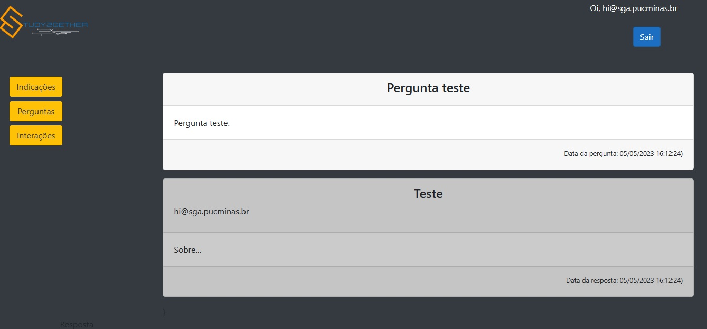 | Data do Teste: 27/05/2023 - Resultado: POSITIVO - A aplicação está apresentando todas as perguntas com os respectivos comentários para usuários "logados", e ele consegue visualizar as repostas. | Sucesso |
| Registro da tela: | 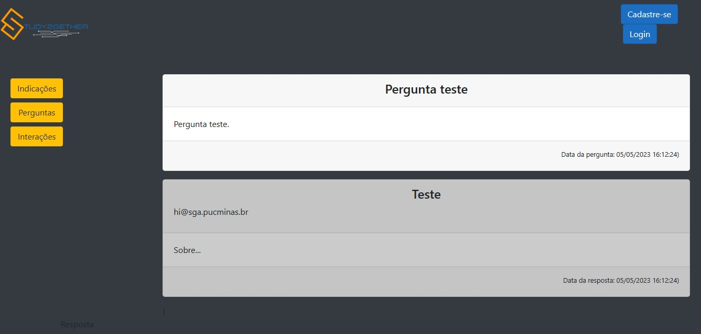 | Data do Teste: 27/05/2023 - Resultado: POSITIVO - A aplicação está apresentando todas as perguntas com os respectivos comentários para usuários "não logados", e ele consegue visualizar as repostas. | Sucesso |

| **ID** | **Descrição do teste** | **Descrição do resultado** | **Gravidade** |
|:---: |:---: |:---: |:---: |
| CT-32 - RF-08 | Verificar se a aplicação está apresentando todas as interações com os respectivos comentários para todos os usuários, logados ou não. ||  |
| Registro da tela: ||Data do teste: 06/05/2023 - As interações estão sendo apresentadas, no entanto os comentarios ainda não estão implementados| Grave|
| Registro da tela: |  | Data do Teste: 21/05/2023 - Resultado: NEGATIVO - A página de Interações não pode ser acessada por uma excessão apontada, não sendo possível verificar se as interações com os respectivos comentários estão sendo apresentados para todos os usuários, logados ou não. Ação: Tratar primeiro a excessão apontada e então verificar se as postagem estão sendo apresentadas a todos os usuários com os seus respectivos comentários. | Grave |
| Registro da tela: ||Data do teste: 24/05/2023 - As interações estão sendo apresentadas, e ao clicar no titulo da interação, é possivel visualizar a respostas referente á publicação|Baixa|
| Registro da tela: |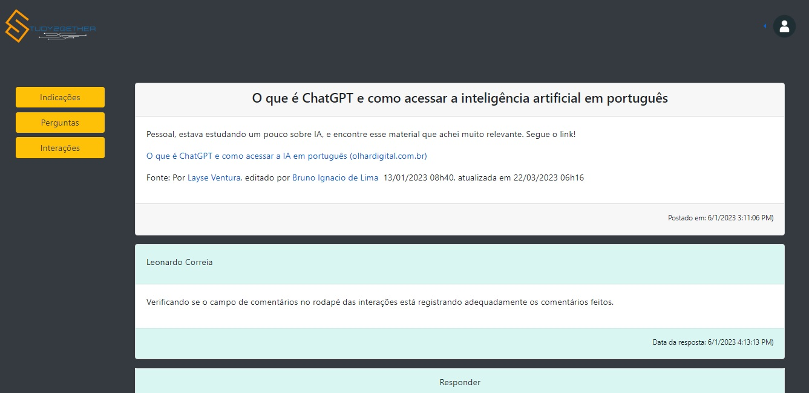|Data do teste: 02/06/2023 - Resultado: POSITIVO - A aplicação está apresentando todas as interações com os respectivos comentários para usuários "logados", e ele consegue visualizar as repostas. | Sucesso |
| Registro da tela: |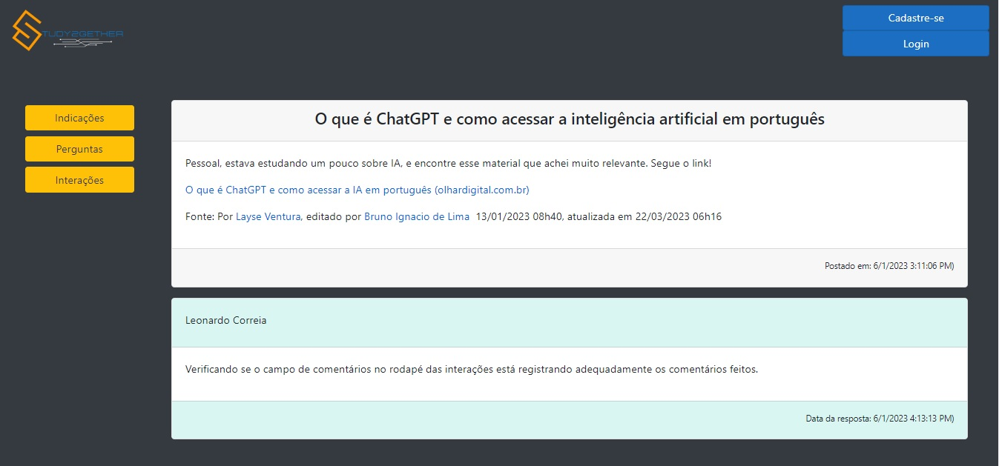|Data do teste: 02/06/2023 - Resultado: POSITIVO - A aplicação está apresentando todas as interações com os respectivos comentários para usuários "não logados", e ele consegue visualizar as repostas. | Sucesso |

| **ID** | **Descrição do teste** | **Descrição do resultado** | **Gravidade** |
|:---: |:---: |:---: |:---: |
| CT-33 - RF-08 | Verificar se a aplicação está apresentando todas as indicações com os respectivos comentários para todos os usuários, logados ou não. |    |    |
| Registro da tela: |  | Resultado Negativo - Não foram apresentadas todas as respostas respectivas a indicação - Data do Teste: 06/05/2023 | Grave |
| Registro da tela: |  | Data do Teste: 21/05/2023 - Resultado Positivo - A aplicação apresentou todas as indicações com os respectivos comentários para os usuários logados.| - |
| Registro da tela: |  | Data do Teste: 21/05/2023 - Resultado Positivo - A aplicação apresentou todas as indicações com os respectivos comentários para os usuários não logados, também.| Sucesso |

| **ID** | **Descrição do teste** | **Descrição do resultado** | **Gravidade** |
|:---: |:---: |:---: |:---: |
| CT-34 - RF-07 | Verificar se as interações do usuário estão sendo apresentadas corretamente na página de Perfil do usuário. |  |  |
| Registro da tela: | |Data do Teste: 04/05/23 - Resultado Negativo - A tela Histórico não apresentou todos os históricos aguardados nas devidas abas. As Perguntas e Interações, vieram corretamente, porém, ao testar o input de uma Resposta ela não veio para o Histórico. Quanto a aba Favoritos ainda não veio nenhum resultado. AÇÃO DE CORREÇÃO: Realizar revisão do código da funcionalidade Post Resposta e implementar a funcionalidade de "Favoritar" | Grave |
| Registro da tela: | |Data do Teste: 16/05/23 - Resultado Positivo - A tela Histórico apresentou todas as ações de Postagens e Favoritados conforme planejado nas devidas abas, com a formatação adequada e com o link no título levando o usuário ao Post na tela de origem, possibilitando sua leitura completa. Foi realizado a implementação da funcionalidade de "Favoritar" aqueles conteúdos e postagens de interesse. | Sucesso |

| **ID** | **Descrição do teste** | **Descrição do resultado** | **Gravidade** |
|:---: |:---: |:---: |:---: |
| CT-35 - RNF-01 e RNF-03 | Verificar se a aplicação está publicada na internet e acessível pelo navegador Chrome. |    |    |
| Registro da tela: | | | |

| **ID** | **Descrição do teste** | **Descrição do resultado** | **Gravidade** |
|:---: |:---: |:---: |:---: |
| CT-36 - RNF-01 e RNF-03 | Verificar se a aplicação está publicada na internet e acessível pelo navegador Firefox. |    |    |
| Registro da tela: | | | |

| **ID** | **Descrição do teste** | **Descrição do resultado** | **Gravidade** |
|:---: |:---: |:---: |:---: |
| CT-37 - RNF-01 e RNF-03 | Verificar se a aplicação está publicada na internet e acessível pelo navegador Edge. |    |    |
| Registro da tela: | | | |

| **ID** | **Descrição do teste** | **Descrição do resultado** | **Gravidade** |
|:---: |:---: |:---: |:---: |
| CT-38 - RNF-04 | Verificar se o tempo de resposta da aplicação não será superior a 30 segundos. |    |    |
| Registro da tela: | | | |

| **ID** | **Descrição do teste** | **Descrição do resultado** | **Gravidade** |
|:---: |:---: |:---: |:---: |
| CT-39 - RNF-05 | Verificar se a aplicação permanecerá acessível sem interrupções por pelo menos 95% do tempo. |    |    |
| Registro da tela: | | | |

| **ID** | **Descrição do teste** | **Descrição do resultado** | **Gravidade** |
|:---: |:---: |:---: |:---: |
| CT-40 - RNF-02 - RNF-06 | Verificar se as telas estão sendo responsivas aos diversos tamanhos de tela. |    |    |
| Registro da tela: | | Data do Teste: 05/05/23 - Resultado Negativo - A tela Histórico não apresentou uma responsividade satisfatória. AÇÃO DE CORREÇÃO: Realizar revisão do CSS com a aplicação do @Media para correção da superposição das telas em dimensões menores. | Médio |
| Registro da tela: || Data do Teste: 16/05/23 - Resultado Positivo - A tela Histórico apresentou uma responsividade satisfatória. | Sucesso |
| Registro da tela: |  | Data do Teste: 01/06/23 - Resultado Positivo - O teste da URL foi feito no site mobile-friendly test o resultado foi de sucesso. | Sucesso |

| **ID** | **Descrição do teste** | **Descrição do resultado** | **Gravidade** |
|:---: |:---: |:---: |:---: |
| CT-41 - RNF-02 - RNF-06 | Verificar se o contraste dos elementos das telas estão com boa qualidade. |    |    |
| Registro da tela: || Data do Teste: 05/05/23 - Resultado Positivo - A Tela Editar Perfil apresentou uma qualidade satisfatória no contraste dos seus elementos. | Sucesso |

