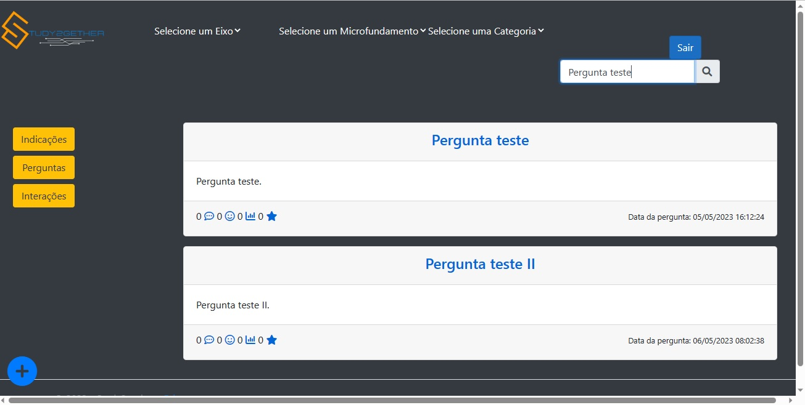

# Registro de Testes de Software

Pré-requisitos: <a href="3-Projeto de Interface.md"> Projeto de Interface</a>, <a href="8-Plano de Testes de Software.md"> Plano de Testes de Software</a>

## Avaliação
| **ID** | **Descrição do teste** | **Descrição do resultado** | **Gravidade** |
|:---: |:---: |:---: |:---: |
| CT-01 - RF-06 | Verificar se o usuário consegue se cadastrar na aplicação. 
| Registro da tela: |  | Data do Teste: 06/05/2023 - Resultado: Positivo - O cadastro foi realizado com sucesso. | Alta |

| **ID** | **Descrição do teste** | **Descrição do resultado** | **Gravidade** |
|:---: |:---: |:---: |:---: |
| CT-02 - RF-06 | Verificar se é impossível se cadastrar duas vezes com o mesmo e-mail. 
| Registro da tela:|   | Data do Teste: 06/05/2023 - Resultado: Positivo - Aparece uma mensagem de erro informando que o usuário ja foi cadastrado | Alta | 

| **ID** | **Descrição do teste** | **Descrição do resultado** | **Gravidade** |
|:---: |:---: |:---: |:---: |
| CT-03 - RF-06 | Verificar se o usuário consegue realizar o Login na aplicação. 
| Registro da tela:|  | Data do Teste: 06/05/2023 - Resultado: Positivo - O Login foi realizado com sucesso. | Alta | 

| **ID** | **Descrição do teste** | **Descrição do resultado** | **Gravidade** |
|:---: |:---: |:---: |:---: |
| CT-04 - RF-06 | Verificar se o sistema impede a realização de login com campos em branco ou inválidos. 
| Registro da tela:|  | Data do Teste: 06/05/2023 - Resultado: Positivo - Aparece uma mensagem de erro caso todos os campos obrigatórios não estejam preenchidas. | Alta |  

| **ID** | **Descrição do teste** | **Descrição do resultado** | **Gravidade** |
|:---: |:---: |:---: |:---: |
| CT-05 - RF-10 | Verificar se o usuário cadastrado consegue redefinir sua senha esquecida. |    |    |
| Registro da tela: |

| **ID** | **Descrição do teste** | **Descrição do resultado** | **Gravidade** |
|:---: |:---: |:---: |:---: |
| CT-06 - RF-10 | Verificar se a aplicação impede a recuperação de senha com um e-mail inválido. |    |    |
| Registro da tela: |

| **ID** | **Descrição do teste** | **Descrição do resultado** | **Gravidade** |
|:---: |:---: |:---: |:---: |
| CT-07 - RF-02 | Verificar se o filtro por Eixo está fazendo a busca correta de Perguntas por Eixo. |    |    |
| Registro da tela: |  | Data do Teste: 06/05/2023 - Resultado: NEGATIVO - Os Eixos ainda não foram inseridos para que o usuário possa selecioná-los. | Grave |

| **ID** | **Descrição do teste** | **Descrição do resultado** | **Gravidade** |
|:---: |:---: |:---: |:---: |
| CT-08 - RF-02 | Verificar se o filtro por Microfundamento está fazendo a busca correta de Perguntas por este Microfundamento. |    |    |
| Registro da tela: |  | Data do Teste: 06/05/2023 - Resultado: NEGATIVO - Os Microfundamentos ainda não foram inseridos para que o usuário possa selecioná-los. | Grave |

| **ID** | **Descrição do teste** | **Descrição do resultado** | **Gravidade** |
|:---: |:---: |:---: |:---: |
| CT-09 - RF-02 | Verificar se o filtro por Categoria está fazendo a busca correta de Perguntas por essa categoria. |    |    |
| Registro da tela: |  | Data do Teste: 06/05/2023 - Resultado: NEGATIVO - As Categorias ainda não foram inseridas para que o usuário possa selecioná-las. | Grave |

| **ID** | **Descrição do teste** | **Descrição do resultado** | **Gravidade** |
|:---: |:---: |:---: |:---: |
| CT-11 - RF-02 | Verificar se o filtro por Microfundamento está fazendo a busca correta de Interações por este Microfundamento. |    |    |
| Registro da tela: |

| **ID** | **Descrição do teste** | **Descrição do resultado** | **Gravidade** |
|:---: |:---: |:---: |:---: |
| CT-13 - RF-02 | Verificar se o filtro por Eixo está fazendo a busca correta de Indicações por Eixo. | ||
| Registro da tela: ||Data do Teste: 06/05/2023 - Resultado: NEGATIVO - A funcionalidade dos filtros de pesquisa ainda não foram implementada.| Alta|

| **ID** | **Descrição do teste** | **Descrição do resultado** | **Gravidade** |
|:---: |:---: |:---: |:---: |
| CT-14 - RF-02 | Verificar se o filtro por Microfundamento está fazendo a busca correta de Indicações por Microfundamento. |    |    |
| Registro da tela: |

| **ID** | **Descrição do teste** | **Descrição do resultado** | **Gravidade** |
|:---: |:---: |:---: |:---: |
| CT-15 - RF-02 | Verificar se o filtro por Categoria está fazendo a busca correta de Indicações por essa categoria. |    |    |
| Registro da tela:| |Data do Teste: 06/05/2023 - Resultado: NEGATIVO - A funcionalidade dos filtros de pesquisa ainda não foram implementada.| Alta|

| **ID** | **Descrição do teste** | **Descrição do resultado** | **Gravidade** |
|:---: |:---: |:---: |:---: |
| CT-16 - RF-05 | Verificar se a busca de perguntas por palavra chave digitada na barra de pesquisa está trazendo o resultado correto. |    |    |
| Registro da tela: |  | Data do Teste: 06/05/2023 - Resultado: NEGATIVO - O botão de pesquisa não está funcionando. | Grave |

| **ID** | **Descrição do teste** | **Descrição do resultado** | **Gravidade** |
|:---: |:---: |:---: |:---: |
| CT-17 - RF-05 | Verificar se a busca de interações por palavra chave digitada na barra de pesquisa está trazendo o resultado correto. |    |    |
| Registro da tela:| |Data do Teste: 06/05/2023 - Resultado: NEGATIVO - A funcionalidade dos filtros de pesquisa ainda não foram implementada.| Alta|

| **ID** | **Descrição do teste** | **Descrição do resultado** | **Gravidade** |
|:---: |:---: |:---: |:---: |
| CT-19 - RF-03 | Verificar se usuário consegue postar uma pergunta. |    |    |
| Registro da tela: |  | Data do Teste: 06/05/2023 - Resultado: POSITIVO - O usuário consegue realizar a postagem de perguntas. | Sucesso |

| **ID** | **Descrição do teste** | **Descrição do resultado** | **Gravidade** |
|:---: |:---: |:---: |:---: |
| CT-20 - RF-03 | Verificar se o usuário consegue postar sua pergunta mesmo sem preencher todos os campos de “Categoria”, “Eixo”, “Microfundamento” e “Título”. |    |    |
| Registro da tela: |  | Data do Teste: 06/05/2023 - Resultado: POSITIVO - O usuário consegue realizar a postagem de perguntas sem selecionar os campos “Categoria”, “Eixo”, “Microfundamento” e “Título”. | Grave |

| **ID** | **Descrição do teste** | **Descrição do resultado** | **Gravidade** |
|:---: |:---: |:---: |:---: |
| CT-21 - RF-04 | Verificar se as respostas serão apresentadas corretamente junto às perguntas. |    |    |
| Registro da tela: |  | Data do Teste: 05/05/23 - Resultado Negativo - Não foi possivel verificar se as respostas foram apresentadas corretamente.  | Grave |

| **ID** | **Descrição do teste** | **Descrição do resultado** | **Gravidade** |
|:---: |:---: |:---: |:---: |
| CT-22 - RF-04 | Verificar se o campo de comentários no rodapé das interações está registrando adequadamente os comentários feitos. |    |    |
| Registro da tela: |  | Data do Teste: 05/05/23 - Resultado Negativo - Não foi possivel verificar se o campo de comentários está registrando adequadamente os comentários feitos. | Grave |   

| **ID** | **Descrição do teste** | **Descrição do resultado** | **Gravidade** |
|:---: |:---: |:---: |:---: |
| CT-23 - RF-04 | Verificar se o campo de comentários no rodapé das indicações está registrando adequadamente os comentários feitos. |    |    |
| Registro da tela: |  | Data do Teste: 05/05/23 - Resultado Negativo - Não foi possivel verificar se o campo de comentários das indicações está registrando adequadamente os comentários feitos. | Grave | 

| **ID** | **Descrição do teste** | **Descrição do resultado** | **Gravidade** |
|:---: |:---: |:---: |:---: |
| CT-24 - RF-01 | Verificar se as publicações estão sendo apresentadas na "Lista de Interações". |    |    |
| Registro da tela: ||Data do teste: 06/05/2023 - Resultado Positivo - As publicações de interações estão sendo apresentadas na pagina correta.|Baixa|

| **ID** | **Descrição do teste** | **Descrição do resultado** | **Gravidade** |
|:---: |:---: |:---: |:---: |
| CT-25 - RF-01 | Verificar se o usuário consegue postar conteúdos mesmo sem preencher todos os campos de “Categoria”, “Eixo”, “Microfundamento” e “Título”. |    |    |
| Registro da tela: |  | Data do Teste: 06/05/2023 - Resultado: POSITIVO - O usuário consegue realizar a postagem de conteúdos sem selecionar os campos “Categoria”, “Eixo”, “Microfundamento” e “Título”. | Grave |

| **ID** | **Descrição do teste** | **Descrição do resultado** | **Gravidade** |
|:---: |:---: |:---: |:---: |
| CT-26 - RF-11 | Verificar se as postagens de indicações estão sendo apresentadas na "Lista de Indicações". |    |    |
| Registro da tela: |  | Resultado Positivo - As postagens foram devidamente apresentadas - Data do Teste: 06/05/2023 | Sucesso |

| **ID** | **Descrição do teste** | **Descrição do resultado** | **Gravidade** |
|:---: |:---: |:---: |:---: |
| CT-27 - RF-11 | Verificar se o usuário consegue postar conteúdos mesmo sem preencher todos os campos de “Categoria”, “Eixo”, “Microfundamento” e “Título”. |    |    
| Registro da tela: |  | Resultado negativo - A aplicação não permitiu a postagem da indicação, mas não retornou nenhum erro ou aviso sobre os campos obrigatorios - Data do Teste: 06/05/2023 | Baixa |

| **ID** | **Descrição do teste** | **Descrição do resultado** | **Gravidade** |
|:---: |:---: |:---: |:---: |
| CT-28 - RF-09 | Verificar se os emojis estão sendo ativados corretamente. |    |    |
| Registro da tela: |  | Data do Teste: 06/05/2023 - Resultado: NEGATIVO - O usuário não consegue reagir às perguntas com emojis. | Grave |

| **ID** | **Descrição do teste** | **Descrição do resultado** | **Gravidade** |
|:---: |:---: |:---: |:---: |
| CT-29 - RF-09 | Verificar se os emojis estão sendo ativados corretamente. |    |    |
| Registro da tela: |  | Data do Teste: 05/05/23 - Resultado Negativo - Não foi possivel verificar a ativação dos emojis nas Respostas | Media | 

| **ID** | **Descrição do teste** | **Descrição do resultado** | **Gravidade** |
|:---: |:---: |:---: |:---: |
| CT-30 - RF-09 | Verificar se os emojis estão sendo ativados corretamente. |    |    |
| Registro da tela: || Data do teste: 06/05/2023 - Os emojis estão sendo contabilizados corretamente, mas passará por nova validação| Média |

| **ID** | **Descrição do teste** | **Descrição do resultado** | **Gravidade** |
|:---: |:---: |:---: |:---: |
| CT-31 - RF-09 | Verificar se os emojis estão sendo ativados corretamente. |    |    |
| Registro da tela: |  | Data do Teste: 05/05/23 - Resultado Negativo - Não foi possivel verificar a ativação dos emojis nos Comentários das Interações | Media | 

| **ID** | **Descrição do teste** | **Descrição do resultado** | **Gravidade** |
|:---: |:---: |:---: |:---: |
| CT-32 - RF-09 | Verificar se os emojis estão sendo ativados corretamente. |    |    |
| Registro da tela: |  | Data do Teste: 05/05/23 - Resultado Negativo - Foi possivel reagir a publicação, mas as unicas opções eram estrela e sorriso | Baixa |

| **ID** | **Descrição do teste** | **Descrição do resultado** | **Gravidade** |
|:---: |:---: |:---: |:---: |
| CT-33 - RF-09 | Verificar se os emojis estão sendo ativados corretamente. |    |    |
| Registro da tela: |  | Data do Teste: 05/05/23 - Resultado Negativo - Não foi possivel verificar a ativação dos emojis nos Comentários das Indicações | Media | 

| **ID** | **Descrição do teste** | **Descrição do resultado** | **Gravidade** |
|:---: |:---: |:---: |:---: |
| CT-34 - RF-08 | Verificar se a aplicação está apresentando todas as Perguntas com as respectivas Respostas para todos os usuários, logados ou não. |    |    |
| Registro da tela: |  | Data do Teste: 06/05/2023 - Resultado: NEGATIVO - O botão "Enviar" não está funcionando, logo não é possível enviar respostas para realizar o teste. | Grave |

| **ID** | **Descrição do teste** | **Descrição do resultado** | **Gravidade** |
|:---: |:---: |:---: |:---: |
| CT-35 - RF-08 | Verificar se a aplicação está apresentando todas as interações com os respectivos comentários para todos os usuários, logados ou não. ||  |
| Registro da tela: ||Data do teste: 06/05/2023 - As interações estão sendo apresentadas, no entanto os comentarios ainda não estão implementados| Grave|

| **ID** | **Descrição do teste** | **Descrição do resultado** | **Gravidade** |
|:---: |:---: |:---: |:---: |
| CT-36 - RF-08 | Verificar se a aplicação está apresentando todas as indicações com os respectivos comentários para todos os usuários, logados ou não. |    |    |
| Registro da tela: |  | Resultado Negativo - Não foram apresentadas todas as respostas respectivas a indicação - Data do Teste: 06/05/2023 | Grave |

| **ID** | **Descrição do teste** | **Descrição do resultado** | **Gravidade** |
|:---: |:---: |:---: |:---: |
| CT-37 - RF-07 | Verificar se as interações do usuário estão sewndo apresentadas corretamente na página de Perfil do usuário. |  |  |
| Registro da tela: | |Data do Teste: 04/05/23 - Resultado Negativo - A tela Histórico não apresentou todos os históricos aguardados nas devidas abas. As Perguntas e Interações, vieram corretamente, porém, ao testar o input de uma Resposta ela não veio para o Histórico. Quanto a aba Favoritos ainda não veio nenhum resultado. AÇÃO DE CORREÇÃO: Realizar revisão do código da funcionalidade Post Resposta e implementar a funcionalidade de "Favoritar" | Grave |

| **ID** | **Descrição do teste** | **Descrição do resultado** | **Gravidade** |
|:---: |:---: |:---: |:---: |
| CT-43 - RNF-02 - RNF-06 | Verificar se as telas estão sendo responsivas aos diversos tamanhos de tela. |    |    |
| Registro da tela: | | Data do Teste: 05/05/23 - Resultado Negativo - A tela Histórico não apresentou uma responsividade satisfatória. AÇÃO DE CORREÇÃO: Realizar revisão do CSS com a aplicação do @Media para correção da superposição das telas em dimensões menores. | Médio |

| **ID** | **Descrição do teste** | **Descrição do resultado** | **Gravidade** |
|:---: |:---: |:---: |:---: |
| CT-44 - RNF-02 - RNF-06 | Verificar se o contraste dos elementos das telas estão com boa qualidade. |    |    |
| Registro da tela: || Data do Teste: 05/05/23 - Resultado Positivo - A Tela Editar Perfil apresentou uma qualidade satisfatória no contraste dos seus elementos. | - |

